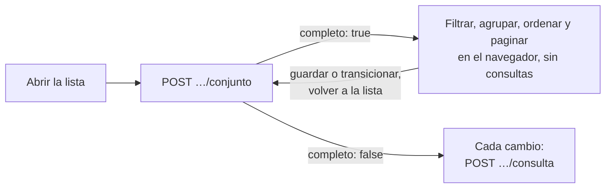

# Contrato HTTP de la consulta de listas (resuelve P-28)

La forma de la consulta y del resultado es la de [07 §4.1](../../../../docs/diseno/07-contratos-visuales.md#41-origen-de-datos-de-lista). Este documento fija la ruta, el formato y los errores. Al cerrar F1 pasa a `docs/diseno/` y P-28 se borra de `preguntas-abiertas.md`. Decisión y alternativas: [research R-03](../research.md).

## Rutas

| Método y ruta | Qué hace |
| :--- | :--- |
| `GET /api/v1/{modulo}/{lista}/vista` | Descripción de la vista de búsqueda de la lista |
| `POST /api/v1/{modulo}/{lista}/conjunto` | Devuelve el conjunto completo de la lista si cabe en el umbral (D-151) |
| `POST /api/v1/{modulo}/{lista}/consulta` | Ejecuta una `ConsultaLista` en el servidor y devuelve un `ResultadoLista`; solo se usa cuando el conjunto no cabe |

Listas de F1:

| `{modulo}/{lista}` | Llave de favoritos | Permiso de lectura |
| :--- | :--- | :--- |
| `ventas/pedidos` | `ventas.pedidos` | `ventas.pedido.leer` |
| `catalogos/productos` | `catalogos.productos` | `catalogos.producto.leer` |
| `catalogos/clientes` | `catalogos.clientes` | `catalogos.cliente.leer` |
| `plataforma/usuarios` | `plataforma.usuarios` | `plataforma.usuarios.leer` |
| `plataforma/grupos` | `plataforma.grupos` | `plataforma.grupos.leer` |

Las tres rutas exigen sesión (`401` sin ella) y el permiso de lectura de la lista (`403` sin él).

## `GET …/vista`

```json
{
  "lista": "ventas.pedidos",
  "columnas": [
    { "campo": "folio", "etiqueta": "Folio", "ordenable": true, "sumable": false },
    { "campo": "cliente", "etiqueta": "Cliente", "ordenable": true, "sumable": false },
    { "campo": "fechaPromesa", "etiqueta": "Entrega estimada", "ordenable": true, "sumable": false, "tipo": "fecha" },
    { "campo": "estado", "etiqueta": "Estado", "ordenable": true, "sumable": false }
  ],
  "campos": [ { "campo": "folio", "etiqueta": "Folio" }, { "campo": "cliente", "etiqueta": "Cliente" } ],
  "filtros": [
    { "nombre": "Borrador", "campo": "Estado" },
    { "nombre": "Confirmado", "campo": "Estado" },
    { "nombre": "Mis pedidos", "campo": "Responsable" },
    { "nombre": "Por autorizar", "campo": "Firmas" }
  ],
  "agrupaciones": [ { "etiqueta": "Estado", "campo": "estado" }, { "etiqueta": "Cliente", "campo": "cliente" } ],
  "agrupacionesPorDefecto": []
}
```

El panel de búsqueda pinta la vista con esta descripción. Los filtros con nombre se evalúan en el servidor por su nombre; los del mismo `campo` se unen con O y los de campos distintos se cruzan con Y.

## Modo híbrido (D-151)

`OrigenHttp<T>` pide primero el conjunto. Si cabe, resuelve todo en el navegador sin nuevas consultas; si no, cambia al modo servidor. La pantalla no nota la diferencia.



## `POST …/conjunto`

**Cuerpo**: `{}`. El umbral lo fija el servidor (`Listas:Umbral`, 5,000).

**Respuesta `200`**, si cabe:

```json
{
  "completo": true,
  "total": 412,
  "generado": "2026-10-13T10:15:02-06:00",
  "filas": [
    { "id": 15, "folio": "PV-2026-0015", "cliente": "EMM-001 - EMPRESA MEXICANA DE MANUFACTURA", "estado": "Confirmado", "_filtros": ["Confirmado", "Por autorizar", "Mis pedidos"] }
  ]
}
```

Si no cabe: `{ "completo": false, "total": 6120 }`, sin filas.

- Las reglas de fila ya están aplicadas: el conjunto solo trae lo que el usuario puede ver.
- `_filtros` lista los filtros con nombre de la vista que cumple la fila, evaluados en el servidor (algunos dependen del usuario). El navegador los combina con la misma regla: O dentro del mismo campo, Y entre campos.
- La búsqueda es `contiene` sin distinguir mayúsculas ni acentos, sobre los `campos` de la vista. Las agrupaciones y el orden usan los campos de la fila; los subtotales suman las columnas `sumables`.
- Una prueba de la web verifica que, después del conjunto, filtrar, agrupar, ordenar y paginar no hacen ninguna petición.

## `POST …/consulta`

**Cuerpo**: `ConsultaLista` tal cual, en camelCase.

```json
{
  "pagina": 0, "tamano": 80,
  "orden": [ { "campo": "fechaPromesa", "desc": false } ],
  "filtros": [ { "campo": "moneda", "operador": "en", "valor": ["MXN", "USD"] } ],
  "nombrados": ["Confirmado", "Por autorizar"],
  "busqueda": "EMM",
  "agruparPor": ["cliente"],
  "grupo": [],
  "ids": null
}
```

| Campo | Regla |
| :--- | :--- |
| `pagina` | ≥ 0 |
| `tamano` | 20, 40, 80 o 200; otro valor da `400` |
| `orden[].campo` | Una columna `ordenable` de la vista; otra da `400` |
| `filtros[].operador` | `contiene` (texto), `igual`, `entre` (`valor` = `[desde, hasta]`, inclusivo) o `en` (`valor` = arreglo) |
| `nombrados` | Nombres de la vista; un nombre desconocido da `400` |
| `agruparPor` | `campo` o `etiqueta` de una agrupación de la vista |
| `grupo` | La ruta del grupo que se abre: `[{ "campo": "cliente", "valor": "EMM-001" }]` |
| `ids` | Si viene, solo esas filas (exportar seleccionadas); ignora la página |

**Respuesta `200`**: `ResultadoLista<T>`.

```json
{
  "filas": [],
  "grupos": [
    { "campo": "cliente", "valor": "EMM-001", "etiqueta": "EMM-001 - EMPRESA MEXICANA DE MANUFACTURA", "cantidad": 12, "totales": {}, "textos": {} }
  ],
  "total": 5,
  "totales": {}
}
```

- Sin agrupar, o con todos los niveles de `agruparPor` abiertos en `grupo`, la respuesta trae `filas` y `grupos: null`, y `total` cuenta filas.
- Con un nivel por abrir, trae `grupos` (una página de grupos de ese nivel) y `filas: []`, y `total` cuenta grupos (D-140).
- `totales` suma las columnas `sumables` sobre todo el filtro. Si la vista declara una columna de unidad, un grupo con unidades mezcladas no trae total de esa columna (D-140).
- Cada fila trae `id` (para abrir el formulario) y los campos de las columnas.

## Orden de evaluación (servidor y navegador)

El mismo orden aplica en los dos modos, para que den el mismo resultado:

1. Reglas de fila del usuario (R-02). Ningún filtro las amplía (02 §7).
2. Filtros con nombre: O dentro del mismo campo, Y entre campos.
3. Filtros por columna (Y entre ellos).
4. Búsqueda: `contiene` sobre los campos buscables, unidos con O.
5. Ruta del grupo (`grupo`).
6. Agrupación u orden, y página.

Si `orden` viene vacío, se usa el orden por omisión de la lista (Pedidos: folio descendente).

## Errores

Con el formato de `ProblemDetails` que ya usa la API (`ProblemDetailsMiddleware`):

| Código | Cuándo |
| :--- | :--- |
| `400` | Tamaño de página, campo, operador, filtro con nombre o agrupación desconocidos; `valor` con la forma equivocada |
| `401` | Sin sesión |
| `403` | Sin el permiso de lectura de la lista |

## Favoritos

| Método y ruta | Qué hace |
| :--- | :--- |
| `GET /api/v1/plataforma/favoritos/{llaveLista}` | Los favoritos del usuario para esa lista |
| `PUT /api/v1/plataforma/favoritos/{llaveLista}/{nombre}` | Crea o reemplaza uno. Cuerpo: la definición de 07 §4.2 y `porOmision`. Marcar uno por omisión desmarca el anterior |
| `DELETE /api/v1/plataforma/favoritos/{llaveLista}/{nombre}` | Lo borra |

Solo el dueño los ve y los cambia; no hay favoritos compartidos en F1.
