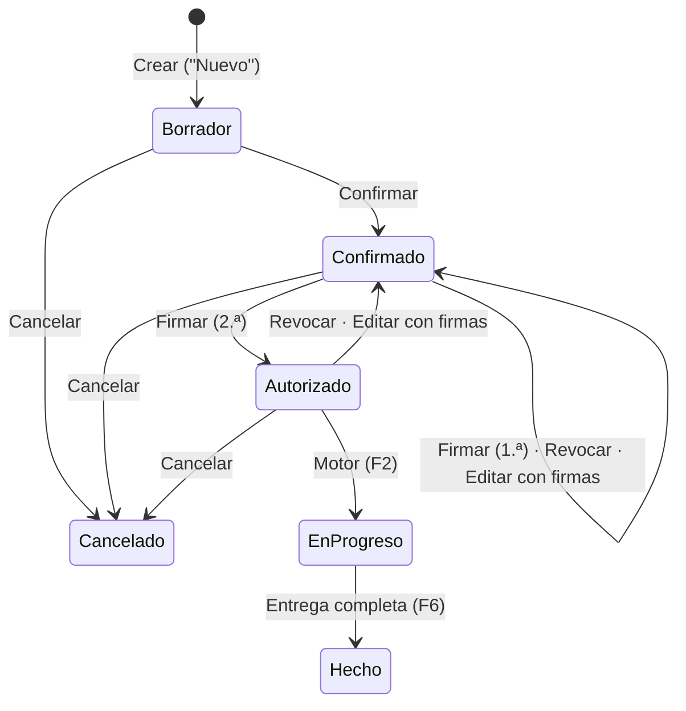

# Modelo de datos: Pedidos de venta (F1)

Entidades nuevas de F1, con sus campos, reglas y transiciones. Todas heredan la base común de F0 (`AuditableEntity` y `ArchivableEntity`, 04 §1): id `bigint`, quién y cuándo creó y modificó, `rowversion` y `is_active`. No se repiten esos campos aquí. Las tablas siguen la convención de F0: esquema por módulo (CT-12) y nombres en `snake_case` singular.

---

## 1. Plataforma · seguridad (`plt`)

### `User` · `plt.user`

| Campo | Tipo | Regla |
| :--- | :--- | :--- |
| `user_name` | `nvarchar(64)` | Único, sin espacios. Es con lo que se entra |
| `display_name` | `nvarchar(120)` | Lo que muestran la barra superior, el chatter y las firmas |
| `email` | `nvarchar(120)`, opcional | Solo informativo en F1 |

- Archivar (`is_active = false`) impide entrar y no borra nada: sus firmas, transiciones y mensajes siguen atribuidos a él (US2, escenario 5).
- Un usuario activo tiene **al menos una** `GroupAssignment` activa (FR-010). `ArchivarAsignacion` rechaza quitar la última.
- Las credenciales viven aparte, en `plt.user_credential` (Identity, R-01), 1:1 por `user_id`.

### `Group` · `plt.group`

| Campo | Tipo | Regla |
| :--- | :--- | :--- |
| `code` | `nvarchar(40)` | Único (`ATENCION_CLIENTES`, `COMERCIAL`, `PRODUCCION_PLANNER`…) |
| `name` | `nvarchar(80)` | Único entre los activos |
| `description` | `nvarchar(400)`, opcional | |

- Los diez grupos iniciales son los roles de 01 §3. Un área con niveles tiene un grupo por nivel (D-148).
- `CopiarDe(grupo)` crea un grupo con los mismos permisos (US2, escenario 7).
- No se borra: se archiva. Archivar un grupo con miembros activos exige quitarlos antes.

### `Permission` · `plt.permission`

| Campo | Tipo | Regla |
| :--- | :--- | :--- |
| `key` | `nvarchar(100)` | Única: `modulo.objeto.accion` (`ventas.pedido.confirmar`) |
| `module`, `object`, `action` | `nvarchar(40)` cada uno | Los tres niveles del árbol de los dos paneles (D-148) |
| `object_kind` | `Documento` o `Funcionalidad` | |
| `label` | `nvarchar(120)` | Lo que se ve en el panel |

- Catálogo cerrado: lo escribe el sembrador desde `Domain/Plataforma/Seguridad/Permisos.cs` (R-02). Nadie lo edita desde la interfaz.

### `GroupPermission` · `plt.group_permission`

`group_id` + `permission_id`, únicos juntos. Lo edita el Administrador con los dos paneles.

### `GroupAssignment` · `plt.group_assignment`

| Campo | Tipo | Regla |
| :--- | :--- | :--- |
| `user_id`, `group_id`, `plant_id` | FK | Únicos juntos |
| `is_substitute` | `bit` | Suplente designado del grupo en esa planta (D-38) |

- `plant_id` apunta a `plt.plant`, que F1 crea: `code` (`PIM`, `SC`, `MTM`) y `name`, sembradas. Las entidades previas a F0 guardan la planta como texto (`PlantCode`) y se ligan a `Plant` cuando su fase las rediseñe.

### `RecordRule` · en código

No es tabla en F1: cada regla es una clase `IReglaDeFila<T>` registrada por tipo (R-02). Pasa a tabla si un día se configuran desde la interfaz.

### Permisos iniciales de F1

| Módulo › Objeto | Acciones | Grupos con el permiso al sembrar |
| :--- | :--- | :--- |
| Ventas › Pedido | `leer`, `crear`, `editar`, `confirmar`, `cancelar` | AC (todo); Administrador (todo); Planner y Tráfico (`leer`) |
| Ventas › Pedido | `firmar_comercial`, `revocar` | Comercial; Administrador (`revocar`) |
| Ventas › Pedido | `firmar_cobranza`, `revocar` | Cobranza |
| Catálogos › Producto | `leer`, `clasificar` | Todos (`leer`); Administrador (`clasificar`) |
| Catálogos › Ficha técnica | `leer`, `editar` | Todos (`leer`); AC y Administrador (`editar`) |
| Catálogos › Cliente | `leer` | Todos |
| Catálogos › Almacén de CONTPAQi | `leer` | Todos |
| Plataforma › Sincronización | `leer`, `ejecutar` | Sistemas y Administrador |
| Plataforma › Usuarios | `leer`, `administrar` | Administrador |
| Plataforma › Grupos | `leer`, `administrar` | Administrador |

`revocar` lo tienen Comercial, Cobranza y Administrador. El dominio exige además que quien revoca sea uno de los firmantes del pedido, salvo el Administrador (D-33).

---

## 2. Plataforma · chatter, favoritos y sincronización (`plt`)

### `ChatterMessage` · `plt.chatter_message`

| Campo | Tipo | Regla |
| :--- | :--- | :--- |
| `document_type` | `nvarchar(60)` | `ventas.pedido` y los tipos registrados en `IDocumentosConChatter` |
| `document_id` | `bigint` | |
| `kind` | `Mensaje`, `Nota` o `Cambio` | `Nota` es interna (Odoo); `Cambio` lo escribe solo el interceptor (R-04) |
| `body` | `nvarchar(4000)` | |
| `author_user_id`, `author_name` | | De la sesión. `Cambio` toma el usuario de la transición |
| `group_exercised` | `nvarchar(80)`, opcional | El grupo con el que actuó (CT-32) |

Solo se inserta. Índice por `(document_type, document_id, created_at desc)`.

### `SavedSearch` · `plt.saved_search`

La forma de `Favorito` de 07 §4.2: `user_id`, `list_key` (`ventas.pedidos`), `name` (único por usuario y lista), `definition` (JSON con filtros, búsqueda, agrupación, orden, columnas y tamaño de página) e `is_default` (uno por usuario y lista).

### `CatalogSyncState` · `plt.catalog_sync_state`

Una fila por catálogo (`productos`, `clientes`, `almacenes`): `watermark`, `last_run_at`, `last_result` (`Exito` o `Error`), `records_read`, `records_changed` y `last_error` (R-05). Solo la escribe la sincronización.

---

## 3. Catálogos (`inv`)

### `Product` · `inv.product` (R-08)

| Campo | Tipo | Regla |
| :--- | :--- | :--- |
| `erp_product_id` | `int` | Único. `CIDPRODUCTO` de CONTPAQi |
| `erp_code` | `nvarchar(30)` | Único. La clave (`PT1113 C567`) |
| `name` | `nvarchar(255)` | Se muestra como "Clave - Nombre" (D-141) |
| `erp_uom` | `nvarchar(10)` | Unidad base (`CABREVIATURA`), D-127 |
| `tracks_lots` | `bit` | Si lleva lote en CONTPAQi |
| `classification_id` | FK, opcional | Propia de PolyConecta (D-86) |
| `erp_synced_at` | `datetimeoffset` | Última vez que la sincronización lo cambió |

- De solo lectura salvo `classification_id` y la ficha técnica (CT-14, FR-015).
- Inactivo en CONTPAQi → archivado. Activo otra vez → restaurado.

### `PackagingUnit` · `inv.packaging_unit`

`product_id`, `code` (`KG`, `MIL`, `PZA`, `ROLLO`…) e `is_erp_base_unit`. En F1 cada producto tiene una sola, la base (D-127).

### `ProductClassification` · `inv.product_classification`

`code`, `name` y `erp_value` (opcional: el valor de "TIPO DE PRODUCTOS" del que nació). La edita el Administrador. La sincronización la usa solo para productos sin clasificación (FR-017).

### Ficha técnica · `inv.roll_specification` y `inv.pt_specification`

1:1 con `Product` por `product_id`. Campos de 04 §3:

| `RollSpecification` | `PtSpecification` |
| :--- | :--- |
| `material_type` | `related_roll_specification_id` (obligatorio) |
| `roll_type_size` | `customer_part_number` |
| `gauge_microns` (`decimal(9,2)`) | `final_size` |
| `kg_per_roll` (`decimal(12,3)`) | `inks` |
| `treatment_dynes` (`int`) | `pantones` |
| `pigment` | `die_cut` (suaje) |
| `additive` | `packaging` |
| `perforation` | `seal_type` |
| `preliminary_print` | `kg_per_thousand` (`decimal(12,4)`, factor de ficha) |

- Se guardan juntos con `Product.GuardarFichaTecnica(rollo, pt)`: los dos bloques siempre (FR-018).
- `related_roll_specification_id` es la del mismo producto o la de otro producto de 2.º proceso.
- Los textos son `nvarchar(120)`, opcionales salvo `material_type` y `roll_type_size`.

### `ErpWarehouse` · `inv.erp_warehouse`

`erp_warehouse_id` (`CIDALMACEN`, único), `erp_code`, `name`. Se sincroniza y no se edita. La sincronización no crea ubicaciones (D-43, US3 escenario 8). El enlace con la ubicación de PolyConecta (`StockLocation.erp_warehouse_id`, 04 §3) se hace cuando se rediseñen las ubicaciones: hoy `StockLocation` y `PolyLocation` son entidades previas a F0, sin la base común, y unificarlas es de F3 (05 §5). En F1 el almacén queda disponible para ese enlace.

---

## 4. Ventas (`ven`)

### `Customer` · `ven.customer`

| Campo | Tipo | Regla |
| :--- | :--- | :--- |
| `erp_customer_id` | `int` | Único. `CIDCLIENTEPROVEEDOR` |
| `erp_code` | `nvarchar(30)` | Único |
| `legal_name` | `nvarchar(60)` | Razón social |
| `tax_id` | `nvarchar(20)`, opcional | RFC |
| `currency` | `char(3)`, opcional | ISO; sin dato, el pedido propone la base (D-146) |

De solo lectura (CT-14). Inactivo en CONTPAQi → archivado.

### `CustomerAddress` · `ven.customer_address` (D-149)

`customer_id`, `erp_address_id` (`CIDDIRECCION`, único), `kind` (`Fiscal` o `Envio`), `street`, `exterior_number`, `interior_number`, `neighborhood`, `postal_code`, `city`, `municipality`, `state`, `country` y `branch`. La sincronización reemplaza los del cliente: agrega, cambia y archiva los que ya no vienen.

### `SalesOrder` · `ven.sales_order`

Hereda `DocumentoConEstado<SalesOrderState>`.

| Campo | Tipo | Regla |
| :--- | :--- | :--- |
| `name` | `nvarchar(20)` | Folio `PV-2026-0001` de `IReferenceSequenceService`, secuencia `PEDIDO_VENTA` (FR-021) |
| `origin` | `Manual` | `Sync` existe en el modelo, pero no se construye (D-145) |
| `customer_id` | FK | Activo al confirmar |
| `customer_po` | `nvarchar(60)`, opcional | Orden de compra del cliente |
| `agent` | `nvarchar(60)`, opcional | Texto libre en F1: el catálogo de agentes de CONTPAQi no está en el contrato |
| `order_date` | `date` | Fecha de negocio (D-123); por omisión, hoy |
| `promise_date` | `date`, opcional | Fecha estimada de entrega (D-140) |
| `delivery_address_id` | FK a `CustomerAddress`, opcional | Propone el de envío (D-149) |
| `delivery_address_text` | `nvarchar(400)`, opcional | Copia del domicilio al confirmar (R-09) |
| `currency` | `char(3)` | Propone la del cliente; admitidas en `Erp:Monedas` (D-146) |
| `exchange_rate` | `decimal(18,6)` | 1 en la moneda base; obligatorio y mayor que 0 en otra |
| `erp_document_id`, `erp_folio` | opcionales | Los llena `ALTA_PEDIDO` en F2 (CT-13) |
| `sync` | `SyncState` | `NoAplica` en F1 |

### `SalesOrderLine` · `ven.sales_order_line`

| Campo | Tipo | Regla |
| :--- | :--- | :--- |
| `sales_order_id` | FK | |
| `sequence` | `int` | Orden de captura |
| `product_id` | FK a `inv.product` | Activo al agregar |
| `requested_qty` | `decimal(18,4)` | Mayor que 0 al confirmar |
| `requested_packaging_unit_id` | FK | Siempre la unidad base del producto; no se elige (D-127) |
| `unit_price` | `decimal(18,6)` | Por la unidad base; obligatorio y ≥ 0 al confirmar (D-74, D-146) |
| `target_production_kg` | `decimal(18,4)`, opcional | Dato; su uso es de F2 (P-25) |
| `tolerance_percentage_override` | `decimal(5,2)`, opcional | |
| `forced_route_id` | opcional | Sin uso hasta F2 |
| `erp_document_line_id` | opcional | F2 |

### `AuthorizationSignature` · `ven.authorization_signature`

| Campo | Tipo | Regla |
| :--- | :--- | :--- |
| `sales_order_id` | FK | |
| `role` | `Comercial` o `Cobranza` | Único por pedido |
| `user_id`, `user_name` | | Quien firma |
| `group_exercised` | `nvarchar(80)` | |
| `is_substitute` | `bit` | Si firmó como suplente (D-38) |
| `signed_at` | `datetimeoffset` | |

Índice único `(sales_order_id, role)` y otro `(sales_order_id, user_id)`: la base también impide que una persona firme dos veces (RF-4).

### Estados y transiciones de `SalesOrder`

| Operación | Desde | Precondiciones | Efecto |
| :--- | :--- | :--- | :--- |
| `Crear` | — | Cliente activo | Borrador, folio, moneda propuesta |
| `Editar(cambios, revocarAutorizacion)` | Borrador, Confirmado, Autorizado | Si hay firmas, `revocarAutorizacion = true` (D-147) | Aplica; con firmas, borra firmas y queda Confirmado con nota "Revocada por edición" |
| `Confirmar` | Borrador | Cliente activo; ≥ 1 línea; cantidad > 0 y precio en cada una; tipo de cambio si no es la moneda base | Confirmado; copia el domicilio |
| `Firmar(usuario, rol, esSuplente)` | Confirmado | El rol no ha firmado; el usuario no ha firmado con ningún rol (RF-3, RF-4) | Agrega la firma; con las dos, Autorizado |
| `Revocar(usuario, motivo)` | Confirmado con firmas, Autorizado | Motivo; el usuario es firmante o Administrador (D-33). Desde F2: ningún documento generado avanzó | Borra firmas; Confirmado |
| `Cancelar(motivo)` | Borrador, Confirmado, Autorizado | Motivo | Cancelado; ya no se edita |

`Editar` en Autorizado solo procede con `revocarAutorizacion = true`, porque Autorizado siempre tiene dos firmas.

Toda operación queda en `StateTransitionLog` y en el chatter (`Cambio`) con usuario y grupo ejercido, incluso las que no cambian de estado (firma, revocación en Confirmado), con origen y destino iguales y la nota de lo que pasó.

---

## 5. Migración

Una migración `F1_PedidosDeVenta` con los esquemas `ven` (nuevo) y las tablas nuevas de `plt` e `inv`, más las tablas de Identity reducidas (`plt.user_credential`, `plt.user_credential_login`, `plt.user_credential_token`). Siembra: plantas, permisos, los diez grupos con sus permisos, la secuencia `PEDIDO_VENTA` y un usuario Administrador inicial con la contraseña de la variable de entorno `Seguridad__AdministradorInicial__Contrasena` (CT-29). Sin la variable, no se crea y el arranque lo registra.
