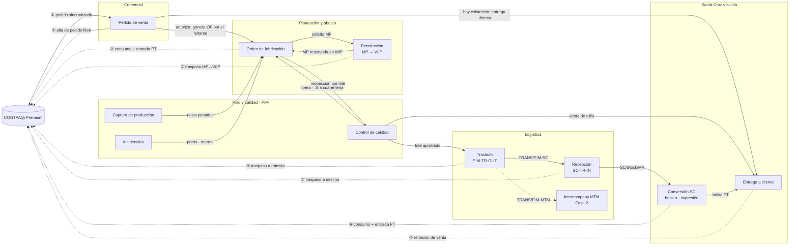

# Módulos y roles

Qué módulos tiene PolyConecta, cómo se conectan, en qué momento tocan CONTPAQi y qué puede hacer cada rol en cada uno. Las reglas de cada módulo están en [02-flujo-y-reglas.md](02-flujo-y-reglas.md).

## 1. Mapa de módulos

Las columnas siguen el avance del pedido. Cada flecha dice qué pasa de un módulo al siguiente; las punteadas hacia CONTPAQi son escrituras en el ERP, y la de Montemorelos es Fase 2.

### Estado de cada módulo

"En prototipo" significa que la pantalla y el flujo existen en `PolyConecta.Presentation` sobre estado en memoria. En todas las pantallas del prototipo falta habilitar el botón **"Nuevo"** para el modo libre (D-52). Ningún módulo está construido todavía sobre la API ni sobre persistencia real. La presentación definitiva será en Angular (D-48).

| Módulo | Estado | Lo que falta |
| :--- | :--- | :--- |
| Pedido de venta | En prototipo | Motor de rutas MTSO/MTO; segregación de firmas por persona, con suplentes |
| Orden de fabricación | En prototipo | Estados estilo Odoo (D-42), planeación por centro, cierre con balance de masa y numeración centralizada |
| Recolección | En prototipo | Restringir la validación al rol de Almacén |
| Captura de producción | En prototipo | Slots precargados y renombrado `.S` |
| Control de calidad | En prototipo | `QualityControl` como documento propio |
| Incidencias | En prototipo | Catálogo de tipos; captura por el Supervisor de turno |
| Traslado / Recepción / Entrega | En prototipo | Spec formal de logística y enlace Remisión ↔ Pedido |
| Conversión Santa Cruz | Parcial | Registro dual millares/kg y factor real (la OF-BOL ya existe) |
| Intercompany MTM | Fase 2 | Todo |
| Inventario actual | En prototipo | Proyección de las cinco cifras (físico, reservado, WIP, disponible, entrante) |
| Usuarios, roles y permisos | Pendiente | Todo (sección 3) |
| Búsqueda y filtros | Parcial | Solo existe la faceta de contexto; falta la vista declarativa en todos los modelos |
| Chatter | En prototipo | Persistencia en la base con registro automático de cambios de estado (D-78) y atribución por usuario |

## 2. Puntos de contacto con CONTPAQi

PolyConecta solo escribe en CONTPAQi cuando un documento **se valida o se cierra**. Mientras una orden sigue abierta, el ERP no cambia. Toda escritura pasa por el outbox y el bridge (Principio II). Todas las ubicaciones, incluido el tránsito, existen como almacenes en CONTPAQi (D-43).

| # | Documento en CONTPAQi | Módulo | Cuándo | Lo dispara |
| :---: | :--- | :--- | :--- | :--- |
| ① | Entra el pedido (lectura) **o** alta del pedido libre (escritura, D-53) | Pedido de venta | Sincronización tras la captura en CONTPAQi, o al confirmar un pedido creado en PolyConecta | Sistema / Atención a Clientes |
| ② | Traspaso MP → WIP (y su inverso) | Recolección | Al validar la salida o la devolución | Almacenista |
| ③ | Consumo de MP + entrada de PT | Orden de fabricación | Al cierre técnico, descontando desde WIP | Planner |
| ④ | Traspaso origen → tránsito | Traslado | Al validar la salida en PIM | Almacenista o Tráfico |
| ⑤ | Traspaso tránsito → destino | Recepción | Al validar la llegada a Santa Cruz | Almacenista SC |
| ⑥ | Consumo de rollo + entrada de bolsa PT | Conversión SC | Al cierre de la OF de bolseo o impresión | Planner SC |
| ⑦ | Remisión de venta | Entrega a cliente | Al validar el despacho | Logística / Tráfico |

## 3. Roles

### Modelo

| Pieza | Qué es |
| :--- | :--- |
| **Usuario** | Una persona con credenciales propias de PolyConecta (D-32) |
| **Rol** | Un conjunto de permisos, no una persona |
| **Asignación** | Usuario × Rol × **Planta**: un usuario puede tener varios roles y el alcance es por planta |
| **Suplente** | Persona designada de antemano para cubrir un rol (D-38); todo queda atribuido a quien actúa |

La seguridad tiene dos capas que no se mezclan:

- **Capa 1, permisos por acción**: qué puede *hacer* un rol sobre un tipo de documento. Es una matriz declarativa, separada del código de negocio.
- **Capa 2, reglas de fila**: sobre *qué registros* puede hacerlo. Son filtros reutilizables por rol, nunca condicionales dispersos.

### Catálogo de roles

| Rol | Responsabilidad | Titulares conocidos |
| :--- | :--- | :--- |
| Atención a Clientes | Captura y confirma el pedido; elige la ruta por línea; decide traspasos y sustituciones | Celia Villarreal |
| Comercial | Firma la autorización comercial | por confirmar (dato de puesta en marcha, D-75) |
| Crédito y Cobranza | Firma la autorización de crédito | por confirmar (dato de puesta en marcha, D-75) |
| Planner | Configura componentes, confirma y planea la OF, vacía los diarios de piso y hace el cierre técnico | Roosvelt (PIM), Diana (SC) |
| Almacenista | Declara y valida lo que sale o entra del almacén de su planta | por confirmar (dato de puesta en marcha, D-75) |
| Calidad | Aprueba o rechaza lotes; es el único que levanta el hard-stop | por confirmar (dato de puesta en marcha, D-75) |
| Logística / Tráfico | Valida entregas a cliente y salidas a flete | por confirmar (dato de puesta en marcha, D-75) |
| Supervisor de turno | Captura las incidencias (paros de máquina) | por confirmar (dato de puesta en marcha, D-75) |
| Administrador | Configura catálogos, ubicaciones, tipos de operación, usuarios y suplentes | por confirmar (dato de puesta en marcha, D-75) |

**Los operadores de máquina no usan el sistema** (D-39). Anotan en los diarios de piso y el Planner los vacía. Se registran como dato (`Operator`) en la planeación y la producción, no como usuarios.

### Matriz rol × módulo (capa 1)

**Negrita** = acción que mueve el documento. `Lee` = solo lectura. `—` = sin acceso.

| Módulo | AC | Comercial | Cobranza | Planner | Almacenista | Calidad | Tráfico | Supervisor | Admin |
| :--- | :---: | :---: | :---: | :---: | :---: | :---: | :---: | :---: | :---: |
| Pedido de venta | **Crea, confirma, cancela** | **Firma 1/2, revoca** | **Firma 2/2, revoca** | Lee | — | — | Lee | — | **Confirma, cancela, revoca** |
| Orden de fabricación | Lee | — | — | **Crea, edita, confirma, planea, cierra** | Lee | Lee | — | Lee | **Todo** |
| Recolección | — | — | — | **Solicita, devuelve**; no valida | **Crea, declara lotes, valida** | Lee | **Valida** | — | **Valida** |
| Captura de producción | — | — | — | **Captura** | — | Lee | — | Lee | **Captura** |
| Control de calidad | — | — | — | Lee | — | **Crea, aprueba, rechaza** | — | — | Registra; no levanta rechazos |
| Incidencias | — | — | — | Lee | — | Lee | — | **Captura** | Lee |
| Traslado | **Decide** | — | — | Lee | **Crea, valida** | — | **Crea, valida** | — | **Valida** |
| Recepción | — | — | — | **Recibe** (SC) | **Crea, valida** | — | **Valida** | — | **Valida** |
| Conversión SC | — | — | — | **Planea, cierra** | — | **Libera** | — | Lee | **Edita** |
| Entrega a cliente | Lee | — | — | — | Lee | — | **Crea, valida** | — | **Valida** |
| Inventario | **Consulta, sustituye** | — | — | **Re-lotifica** | **Re-lotifica** | Lee | — | — | **Todo** |
| Configuración | Lee | Lee | Lee | Lee | Lee | Lee | Lee | Lee | **Configura** |

**Crea** = puede usar "Nuevo" para el modo libre (D-52); en [02-flujo-y-reglas.md §0](02-flujo-y-reglas.md) están el propósito y la restricción de cada documento. La revocación de una autorización solo procede mientras ningún documento generado haya avanzado (D-33). La sustitución de producto la decide AC sin segunda autorización, con motivo obligatorio (D-37).

### Reglas de fila y segregación (capa 2)

| # | Regla |
| :--- | :--- |
| RF-1 | Un Planner solo ve y edita órdenes de **su planta**; las de la otra planta no las ve (D-35). |
| RF-2 | Un Almacenista solo valida operaciones cuyo **almacén origen** pertenece a su planta (D-36). |
| RF-3 | Comercial solo escribe su propia firma; Cobranza, solo la suya. |
| RF-4 | **Ningún usuario aporta las dos firmas del mismo pedido**, aunque tenga ambos roles. Si una persona ejerce los dos, la segunda firma la da el suplente del otro rol (D-34). |
| RF-5 | Los operadores de máquina no tienen acceso al sistema; su producción la captura el Planner (D-39). |
| RF-6 | Los documentos en estado `Hecho` quedan cerrados para todos los roles; se corrigen con un documento inverso. |

Además:

- **Producción pide, Almacén entrega**: el Planner no valida su propia recolección.
- **Hard-stop de Calidad**: ningún rol distinto de Calidad aprueba un lote, y nadie levanta un rechazo vigente sin una nueva liberación.
- Toda transición registra usuario, rol ejercido, fecha y documento, de forma consultable.
- Las acciones no permitidas se muestran deshabilitadas con su razón, no ocultas.
- Cambiar los permisos de un rol no requiere tocar código de negocio.

Fuera de alcance: la requisición de compras de tres firmas (Solicitante / Autorizador / Elaborador), la federación de identidad con CONTPAQi y los permisos por campo.
