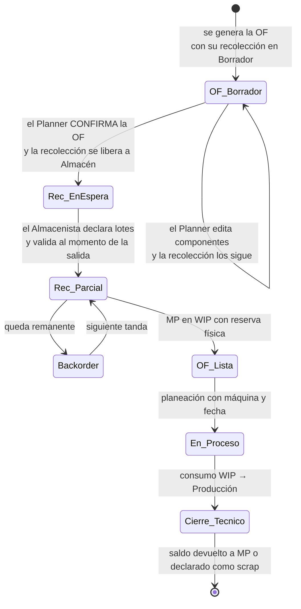

# Flujo operativo y reglas de negocio

Diseño vigente del recorrido de un pedido, desde CONTPAQi hasta la entrega. Consolida el informe de validación (`docs/assesment/`) con las decisiones posteriores tomadas con el usuario. Cuando este documento y el informe difieren, manda este documento; cada diferencia está registrada en [decisiones.md](decisiones.md).

Los identificadores entre corchetes (`[007-FR-013]`) conservan la numeración de las especificaciones de origen, para que la [matriz de pruebas del SDK](../contpaq/MATRIZ_PRUEBAS_SDK_WIP_LOTES.md) siga siendo trazable.

---

## 0. Principio de documento libre (D-52)

Todo documento operativo existe en dos modos:

- **Ligado**: lo genera otro documento (el motor de abastecimiento, una OF, un traslado validado). Guarda su origen y se navega a él por smart button.
- **Libre**: se crea con **"Nuevo"**, sin origen.

El origen es una **referencia opcional, no una precondición**. En los dos modos aplican las mismas reglas: estados, permisos, hard-stop de calidad, balance de masa, escrituras en CONTPAQi y documentos derivados. Por ejemplo, una OF libre con componentes genera su recolección y sus controles de calidad igual que una OF ligada.

| Documento | Modo ligado: lo genera… | Modo libre: para qué | Lo crea | Restricción del modo libre |
| :--- | :--- | :--- | :--- | :--- |
| Pedido de venta | La sincronización desde CONTPAQi | Capturar el pedido en PolyConecta; el bridge lo da de alta en CONTPAQi (D-53) | Atención a Clientes | AC captura precio unitario y moneda (D-74); alta por SDK por verificar (T-12) |
| Orden de fabricación | El motor al autorizar un pedido, o su OF de origen | Producir sin pedido (para stock) | Planner | Sus lotes usan el folio de la OF raíz (D-54) |
| Recolección | Confirmar una OF | Adelantar MP a WIP | Almacenista | Queda como saldo sin asignar y se liga a una OF después (D-55) |
| Control de calidad | Confirmar una OF (un control por lote) | Inspeccionar o volver a liberar lotes existentes | Calidad | Solo sobre lotes existentes |
| Traslado | El motor (regla de traspaso) o la decisión de AC | Mover a otra planta lotes disponibles | Almacenista, Tráfico | Hard-stop: solo lotes liberados |
| Recepción | Validar un traslado | Recibir lotes que están en tránsito | Almacenista | Solo desde `TRANS/*` (D-56) |
| Entrega | El motor al autorizar un pedido | Despachar lotes disponibles | Tráfico | Hard-stop; sin pedido, la remisión no se liga a un pedido |
| Devolución (`REC-RET`) | Cancelar o cerrar una OF | Devolver a MP un saldo de WIP | Almacenista | Cantidad re-pesada a mano |
| Incidencia | — (siempre es libre) | Registrar un paro | Supervisor de turno | — |
| Recepción de compra | La sincronización desde CONTPAQi (D-102) | **No tiene modo libre** | — | Invariante: la compra se captura en CONTPAQi (D-96); en PolyConecta es de solo lectura |

---

## 1. Pedido de venta

### Origen y captura

- El pedido entra de **dos formas** (D-53): Atención a Clientes (AC) lo captura en CONTPAQi y PolyConecta lo sincroniza, o AC lo captura **libre en PolyConecta** y el bridge lo da de alta en CONTPAQi. En los dos casos CONTPAQi sigue siendo el sistema de registro, y la sincronización no debe duplicar un pedido que escribió PolyConecta (T-12).
- Si el cliente requiere un producto nuevo o una especificación distinta, AC o Facturación **da de alta antes el código de PT en CONTPAQi**. Cada especificación de cliente tiene su propio código de PT, para que la remisión y la factura coincidan 1:1 con lo producido.
- El pedido es **maestro + detalle**: PolyConecta lo refleja como `SalesOrder` con sus `SalesOrderLine` (producto + cantidad + unidad). IVA, descuentos y totales se quedan en CONTPAQi. El **precio unitario** solo existe en PolyConecta en el pedido libre, donde lo captura AC para enviarlo a CONTPAQi (D-74); en los pedidos sincronizados queda vacío.
- La **ficha técnica vive en PolyConecta**, no en CONTPAQi. Ni los campos de usuario del documento ni los del producto alcanzan para ella. Se liga al producto por su código ERP y AC la captura en PolyConecta: bloque Rollo (`RollSpecification`) y bloque PT (`PtSpecification`), siempre ambos.
- Se mantiene la meta de **cero archivos OT en Excel**.
- La meta de producción (`target_production_kg`) y la tolerancia se capturan **por línea de pedido**, no en el catálogo.

### Estados

`Borrador → Confirmado → Autorizado → En progreso → Hecho` (y `Cancelado`).

| Transición | Quién | Efecto |
| :--- | :--- | :--- |
| Sincronización o "Nuevo" | Sistema o Atención a Clientes | Crea el pedido en Borrador |
| Confirmar | Atención a Clientes | Pasa a Confirmado |
| Autorizar (1.ª firma) | Comercial **o** Cobranza | Registra la firma; sigue en Confirmado |
| Autorizar (2.ª firma) | El otro rol, **otra persona** | Pasa a Autorizado y dispara el motor de abastecimiento |
| Revocar autorización | Cualquiera de los firmantes o el Administrador, **mientras ningún documento generado haya avanzado** (D-33) | Limpia firmas, libera reservas y descarta documentos generados. Después, se cancela documento por documento |

### Autorización de dos firmas `[007-FR-010..012]`

- **Un único botón "Autorizar"**, visible para Comercial y Cobranza, que registra la firma del rol que lo pulsa. Sustituye los botones separados "Validar Ventas" y "Validar Crédito" del informe de validación.
- Un rol no firma dos veces; un rol no autorizador no firma.
- **Ninguna persona aporta las dos firmas del mismo pedido**, aunque tenga ambos roles (`RF-4`, ver [01-modulos-y-roles.md](01-modulos-y-roles.md)). Si una persona ejerce Comercial y Cobranza, la segunda firma la da el suplente designado del otro rol (D-34).
- La reserva de inventario se compromete **al autorizar**, no antes.

---

## 2. Motor de abastecimiento

Al autorizar, el sistema decide por regla si entrega de existencia, fabrica o traspasa. La decisión vive en el catálogo como **ruta configurada**, no en un cálculo de la pantalla del pedido.

### Rutas y reglas

`[007-FR-002]` Una **ruta** es una secuencia ordenada de **reglas**. Cada regla declara una acción, un origen, un destino y el tipo de operación que genera. Lo que una regla no cubre se convierte en la necesidad que resuelve la siguiente.

| Ruta | Reglas en orden |
| :--- | :--- |
| `MTSO-BOL` | 1. Entregar de `SC/Stock/PT` → `Customers` · 2. Fabricar (`SC-BOL-MO`) |
| `MTSO-IMP` | 1. Entregar de `SC/Stock/MP` → `SC/Produccion` · 2. Fabricar (`SC-IMP-MO`) |
| `MTSO-EXT` | 1. Entregar de `SC/Stock/MP` · 2. Traspasar de `PIM/Stock/PT` · 3. Fabricar (`PIM-MO`) |
| `MTO-BOL` | 1. Fabricar siempre; ignora la existencia |
| `MP-STOCK` | 1. Consumir de `PIM/Stock/MP` → `PIM/Produccion` |
| `STOCK` | 1. Solo entregar de stock; no fabrica |

Una regla de fabricación **relanza necesidades por los componentes** del producto, que se resuelven con la ruta de cada componente:

```
Bolsa 20,000 MIL (hay 3,000)
├─ ENTREGAR   3,000 MIL   SC/Stock/PT → Customers
└─ FABRICAR  17,000 MIL   OF-BOL
   ├─ ENTREGAR   180 kg   rollo impreso existente
   └─ FABRICAR   245 kg   OF-IMP
      ├─ TRASPASAR 200 kg  PIM/Stock/PT → SC/Stock/MP       ← no se extruye: ya existe
      └─ FABRICAR   45 kg  OF-EXT
         └─ componentes desde PIM/Stock/MP
```

### Reglas

- `[007-FR-003]` La ruta se resuelve en cascada **línea → producto → clasificación → predeterminada**, y la pantalla muestra en qué nivel quedó resuelta.
- `[007-FR-009]` AC puede asignar una ruta a una línea concreta, y esa ruta **gana** sobre toda la configuración. AC orquesta la fabricación y puede forzarla aunque haya existencia.
- `[007-FR-004/005]` **MTSO** consume primero la existencia y dispara la regla siguiente **solo por el faltante**. **MTO** fabrica la cantidad completa.
- `[007-FR-007]` El motor corre en la transición a **Autorizado** y genera documentos con folio real: entrega, orden de fabricación o traslado.
- `[007-FR-008]` Antes de autorizar hay una **simulación** que no reserva nada y se muestra como tal.
- `[007-FR-013]` La reserva es **lote por lote** en los productos con lote (rollos y PT; la MP se reserva por cantidad, D-106); el último lote se fracciona **reasignando kg**, no se toma completo. CONTPAQi admite varios lotes y lotes fraccionados en un mismo movimiento (D-82).
- `[007-FR-014]` La entrega se genera **por el total** de la línea. Al entregar en parcialidades, el sistema pregunta si crea un backorder. El backorder solo existe en PolyConecta (D-85).
- `[007-FR-015]` Una necesidad sin cobertura queda **visible** en el plan; nunca desaparece en silencio.
- `[007-FR-016]` El disponible **excluye** cuarentena y scrap.
- `[007-FR-017]` El sistema no propone ni aplica sustituciones de SKU. Toda sustitución es explícita, con motivo y autor. No existe un criterio cerrado: AC es quien primero sabe si un rollo sirve, y decide **sin segunda autorización** (D-37).
- AC decide el **traspaso interplanta** cuando detecta rollo en PIM que puede irse a Santa Cruz.
- `[007-FR-001]` El **visor de disponibilidad**, agrupado por clasificación, es una herramienta de consulta: físico, reservado, en WIP, disponible y entrante. No decide nada. La clasificación es de PolyConecta (D-86); el físico se lee directo de CONTPAQi, agrupando por número de lote (D-83, D-87). Una existencia negativa en CONTPAQi se muestra como disponible 0, con aviso (D-90).

### Dos niveles de reserva

| | Reserva **lógica** | Reserva **física** |
| :--- | :--- | :--- |
| La genera | Autorizar el pedido | Validar la recolección a WIP |
| Ubicación del material | Sigue en `Stock/MP` | Movido a `WIP` |
| Efecto | Resta del disponible | Ya no está en el almacén origen |
| Se revierte con | Cancelar o revocar el pedido | Devolución `REC-RET` |
| Afecta CONTPAQi | No | Sí (par Salida + Entrada, D-79) |

Fuera de alcance por ahora: la compra de materia prima (`MP-STOCK` solo consume; si no alcanza, la necesidad queda expuesta), un catálogo de sustitución por atributos y reglas por cliente o por almacén de despacho.

---

## 3. Órdenes de fabricación

### Jerarquía

- Hay **un solo tipo de orden**, `ManufacturingOrder`, **autorreferenciado** mediante `OriginOrderId`. Sustituye la jerarquía tripartita OM → OF → WO del informe de validación.
- La orden sin origen es la **raíz**: el proceso que se entrega al cliente, que no siempre es bolseo. Su smart button enlaza al pedido; las demás enlazan a su orden de origen.
- Cadena típica (D-05): `Pedido → OF-BOL (raíz) → OF-IMP (origen = BOL) → OF-EXT (origen = IMP)`.
- Cada línea de pedido genera sus propias órdenes (1:1 por línea, no por pedido). Una OF también puede crearse **libre**, sin pedido, para producir para stock (D-52).
- Todas las órdenes usan **el mismo formulario** con cuatro pestañas: Componentes, Subproductos, Producción y Planeación.
- **Estados** (D-42, estilo Odoo): `Borrador → Confirmada → En progreso → Por cerrar → Hecha`, y `Cancelada`. *Por cerrar* es la producción terminada que espera el cierre técnico (balance de masa y declaración de saldo en WIP).

### Las 4 reglas universales de manufactura

Aplican igual a extrusión, impresión y bolseo:

1. La orden nace en `Borrador`; al confirmarla (`Confirmada`) exige tener componentes.
2. Pasa a `En progreso` solo cuando su **planeación** tiene centro de trabajo y fecha.
3. La producción se captura desde los diarios de piso, y cada lote tiene su control de calidad.
4. El cierre técnico calcula el balance de masa y descuenta los insumos **en bloque** en CONTPAQi.

### Componentes, subproductos y planeación

- **Componentes**: lista plana y editable (`Clave`, `Producto`, `Cantidad`, `Unidad`) que muestra la existencia en el almacén de MP. El Planner la **captura a mano**; no hay importación desde Excel (D-41). Puede agregar o borrar líneas libremente antes del cierre, y así se registra la sustitución de materia prima. Ya no hay capas o tolvas A/B/C con porcentaje.
- **Subproductos**: cada orden declara qué productos de scrap resultan de su proceso. Cada uno es un producto CONTPAQi con cantidad, unidad, bandera de producido y almacén destino.
- **Planeación**: tabla de líneas (`PlanningLine`: centro de trabajo, cantidad, unidad, inicio, fin y operador) embebida en la orden. Una orden puede repartirse entre varias máquinas o días. Sustituye a la `WorkOrder` como documento aparte.

### Pesaje y lotes

- Los operadores anotan en diarios físicos a pie de máquina y el **Planner hace el vaciado** en PolyConecta. **No hay handheld, terminal de báscula ni escáner**: todo se captura en el sistema web (D-39). La orden sigue abierta durante toda la corrida.
- Al confirmar la orden se **precargan los slots** (uno por rollo proyectado) y sus inspecciones pendientes.
- **Nomenclatura de lote**: `R{secuencial de 3 dígitos}-{folio del pedido}` para rollos (`R001-IV310-26`) y `C{secuencial}-{folio del pedido}` para bultos o cajas de Santa Cruz (`C001-IV310-26`, D-45). Sustituye al formato `IV214-26-R001` del informe de validación.
- Si la OF **no tiene pedido**, se usa el folio de la OF raíz con `/` cambiado por `-`: `R001-BOL-2026-0007` (D-54). En el nombre de un lote siempre se usa guion medio.
- **Regla de cuarentena `.S`**: un lote rechazado se renombra con sufijo `.S`, pasa a la ubicación de cuarentena de su planta y **libera su secuencial** para el rollo de reposición.
- El nombre del lote es un campo calculado que actualiza la propia operación de dominio; nunca se edita a mano.

### Calidad

- El control de calidad es un **documento propio** (`QualityControl`, folio `QC/2026/000X`). Tiene referencia a la orden, auditor, proceso, estado (`Planeado / Aprobado / Parcial / Rechazado`) y una tabla de controles por lote (producto, lote, cantidad planeada, cantidad real, aprueba o falla), con acciones por línea y globales.
- La auditoría de calidad es **obligatoria en toda corrida**, sin importar el volumen.
- **Hard-stop**: ningún traslado ni entrega se valida con un lote sin liberación de Calidad vigente.
- Una orden **no cierra** mientras tenga lotes en revisión.
- Solo Calidad aprueba o rechaza. Un rechazo vigente no lo levanta nadie, ni el Administrador, sin una nueva liberación.

### Cierre técnico y balance de masa

- Masa total procesada: `Σ rollos (buenos + cuarentena) + Σ scrap`.
- Invariante de entrada: `Recolectado a WIP = Consumido + Devuelto + Scrap`. Si no cuadra, el cierre se bloquea.
- La tolerancia es configurable, con valor global y ajuste por línea de pedido. **La fija Producción** y no hay valor por defecto hasta entonces (D-46).
- El scrap se registra en kg, clasificado por producto (resina y color, para peletizado) y por **motivo de un catálogo cerrado**.
- En CONTPAQi **no se descuenta rollo por rollo**: hay un único descuento consolidado al cierre técnico, **desde el almacén WIP**.
- No se cierra una orden con saldo sin declarar en WIP (ver sección 4).

### Conversión en Santa Cruz

- En bolseo, el **registro es dual**: millares producidos (métrica comercial) y peso neto en kg (báscula).
- Factor real: `kg/millar real = kg pesados / millares`, contrastado contra el factor de la ficha técnica.
- La merma de suaje, troquel y refile se registra como scrap.
- El cierre de la orden raíz marca el pedido como `Hecho`.

### Incidencias

Paros de máquina: fecha, centro de trabajo, tipo (de catálogo), comentarios, hora de inicio y hora de fin. Los captura el **Supervisor de turno** (D-40). Se capturan de forma global y no se ligan a una orden concreta.

---

## 4. Recolección de componentes a WIP

La recolección es una **operación de traslado más** (`PIM-REC-OUT`), no un tipo de documento especial. Es la forma en que Producción pide materia prima a Almacén y Almacén le da salida.



- `[008-FR-001]` WIP es un **almacén contable, uno por planta**. La liga con la OF es un atributo lógico de la reserva, no una subdivisión física.
- `[008-FR-002]` Toda OF con componentes nace con **una** recolección en Borrador, cuyas líneas siguen a los componentes mientras siga en Borrador. Al liberarse, quedan fijas.
- Almacén también puede crear una **recolección libre**, sin OF (D-55). El material queda en WIP como saldo sin asignar y se liga a una OF al confirmarla. Un saldo sin asignar solo sale de WIP por asignación, devolución o scrap.
- `[008-FR-002c]` Confirmar la OF libera la recolección a Almacén, que la valida **cuando el material sale físicamente**.
- `[008-FR-003]` **Solo Almacén valida.** El Planner solicita, pero no surte.
- `[008-FR-004]` El Almacenista declara **lote y cantidad** por línea. El sistema no asigna lotes sin confirmación. La materia prima no lleva lote: en ella se declara solo la cantidad (D-106).
- `[008-FR-005]` Validar mueve el material a WIP, lo reserva físicamente contra la OF y **dispara el traspaso de almacén en CONTPAQi** (par Salida + Entrada, ver [03 §5.1](03-almacenes-y-operaciones.md)). Antes de validar, PolyConecta comprueba la existencia de cada lote en el origen: CONTPAQi no lo impide (D-81).
- `[008-FR-006]` El material en WIP no cuenta como disponible, pero sigue siendo inventario de la empresa.
- `[008-FR-007/008]` Se admite validar en parcialidades, con **backorder** por el remanente. Una parcialidad no impide que la OF arranque. Cada parcialidad es un traspaso propio en CONTPAQi; el backorder vive en PolyConecta (D-85).
- `[008-FR-009]` La devolución (`REC-RET`) puede ser total, por cancelación, o parcial, por sobrante al cierre. Genera el traspaso inverso.
- `[008-FR-009b]` La cantidad devuelta **se re-pesa y se captura a mano**; el sistema no asume el saldo teórico. En CONTPAQi la devolución crea una capa nueva del mismo lote en el almacén origen (D-83).
- `[008-FR-009c]` No se pasa saldo de una OF a otra: el sobrante vuelve a `Stock/MP` y se pide con una recolección nueva.
- `[008-FR-010/012]` El cierre técnico se bloquea mientras haya saldo sin declarar en WIP o no cuadre `Recolectado = Consumido + Devuelto + Scrap`.
- `[008-FR-013]` El patrón es igual para extrusión, impresión y bolseo, parametrizado por almacén.
- La materia prima **no se mueve de noche**: la recolección de lo que consumirá el turno nocturno se surte en el turno de día (D-99). Solo el turno de día registra operaciones en PolyConecta (D-98). Si una OF con planeación nocturna no tiene su recolección validada al acercarse el fin del turno de día, el sistema avisa al Planner y al Almacenista; no bloquea (D-103).

---

## 5. Logística

### Traslado interplanta en dos pasos

1. **Traslado** (`PIM-TR-OUT`): se valida la salida en PIM y el material queda en `TRANS/PIM-SC`. **Se registra en CONTPAQi el traspaso origen → tránsito** (par Salida + Entrada, D-79), porque el tránsito también es un almacén en CONTPAQi (D-43).
2. **Recepción** (`SC-TR-IN`): Santa Cruz valida la llegada, lote por lote, y puede ser parcial (demanda contra cantidad entregada). **Al validar se registra el traspaso tránsito → destino.** Una recepción libre (sin traslado de origen) solo puede recibir lotes que ya estén en tránsito (D-56).

Invariante: todo material que sale de una planta hacia otra permanece en `TRANS/*` hasta que el destino valida la entrada.

### Entrega a cliente

- Documento de **un solo paso** (`PIM-OUT-DIR` para rollo, `SC-OUT-DIR` para bolsa). Tráfico audita el embalaje y valida, y eso **genera la remisión de venta en CONTPAQi**.
- Hay un riesgo abierto: la remisión debe quedar ligada al pedido de origen en CONTPAQi. Si el SDK no lo permite, el pedido queda "pendiente de surtir" para siempre. Se prueba antes de especificar la logística.

### Estados y acciones

| Documento | Estados | Acciones |
| :--- | :--- | :--- |
| Traslado y recepción | `Borrador → En espera de operación → En espera → Listo → Hecho` | Comprobar disponibilidad, Validar, Cancelar, Imprimir |
| Entrega | `Borrador → En espera → Listo → Hecho` | Comprobar disponibilidad, Validar, Cancelar |

### Smart buttons

- Pedido → **Entregas / Envíos** (entrega directa a cliente).
- Orden de fabricación → **Operaciones de traslado** (interplanta).
- Los smart buttons muestran los documentos que generó el motor, no una lista fija.

---

## 6. Unidades de medida

- La **unidad de medida de toda cantidad es la de CONTPAQi** para el producto (KG, MIL, PZA, ROLLO…). Se sincroniza desde CONTPAQi y no se configura en PolyConecta; una línea solo puede usar una unidad que el producto admita allá (D-123, D-124).
- Toda línea, lote y movimiento guarda **dos cantidades**: la cantidad en la unidad de CONTPAQi y el **peso en kg**. **Las dos se capturan siempre**; ninguna se calcula de la otra. Cuando la unidad de CONTPAQi es KG, la cantidad ya es el peso.
- Todo **cálculo interno** (componentes, planeación, balance de masa) usa el **kg capturado**. El factor kg por unidad de la ficha técnica es una referencia para contrastar, como el factor real de bolseo (§4), no una conversión.
- A CONTPAQi viaja la cantidad en su unidad, sin conversión (D-123).

---

## 7. Reglas transversales de interfaz

Siguen el patrón de Odoo 19 (Principio IX de la constitución).

- Las listas, formularios y kanban llevan pipeline de estado en el encabezado y smart buttons con contador.
- **Vista de búsqueda declarativa por modelo** `[010-FR-001..012]`: cada modelo declara sus campos buscables, filtros con nombre y agrupaciones. Ninguna lista codifica su propia búsqueda.
- Todo filtro activo es una **faceta** removible en la barra de búsqueda, incluido el que llega por un smart button. El breadcrumb indica dónde estás; nunca muestra filtros.
- Las facetas del **mismo campo** se combinan con **O**; las de **campos distintos**, con **Y**.
- El estado de los filtros vive en la URL. Los favoritos se guardan por usuario y modelo.
- Alcance inicial: **todos los modelos a la vez**.
- **Un filtro no puede ampliar lo que restringe una regla de fila.** El alcance por planta es una regla de fila (se define en roles y permisos), no un filtro que se pueda quitar.
- Las acciones no permitidas aparecen **deshabilitadas con su razón**, no ocultas.
- Un documento en estado `Hecho` no se edita: se corrige con un documento inverso. En CONTPAQi tampoco se puede desafectar lo ya escrito (D-84).
