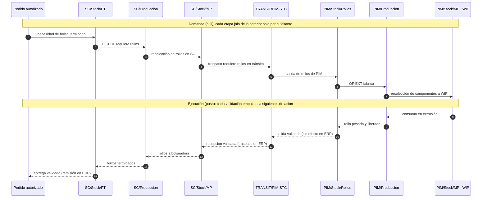

# Almacenes, ubicaciones y tipos de operación

Motor logístico de PolyConecta: dónde vive el material, qué operaciones lo mueven y cuáles de ellas escriben en CONTPAQi. Sigue la arquitectura logística de Odoo 19 (almacenes, ubicaciones físicas y virtuales, tipos de operación y reglas push/pull).

> **Convención de nombres pendiente.** Los documentos y el código usan prefijos distintos para Santa Cruz (`STC` en la constitución y los tipos de operación; `SC` en las ubicaciones del TO-BE y del código) y para el tránsito (`TRANSIT/PIM-STC` o `TRANS/PIM-SC`). Aquí se usan los nombres de la arquitectura aprobada, con su alias. La decisión está en [preguntas-abiertas.md](preguntas-abiertas.md).

## 1. Almacenes

| Código | Planta | Razón social | Función |
| :--- | :--- | :--- | :--- |
| `WH-PIM` | Parque Industrial Monterrey (Apodaca) | Polyempaques | Extrusión de rollos maestros y abasto de resinas |
| `WH-STC` | Santa Cruz (Guadalupe) | Polyempaques | Conversión: impresión, bolseo, corte, suaje y empaque |
| `WH-MTM` | Montemorelos | Empresa filial | Planta multiproceso bajo esquema intercompany |
| `WH-TR` | Virtual | Custodia lógica | Material en tránsito interplanta e intercompany |

La entidad legal se **deriva** de la planta: PIM y Santa Cruz comparten razón social; Montemorelos no.

## 2. Ubicaciones

| Ubicación | Alias en código | Tipo | Significado |
| :--- | :--- | :--- | :--- |
| `PIM/Stock/MP` | — | Física | Resinas, pigmentos y aditivos disponibles |
| `PIM/WIP` | — | Física y contable | MP apartada para producir; sigue siendo inventario, pero no está disponible |
| `PIM/Produccion` | — | Virtual | Entrar aquí es **consumo** |
| `PIM/Stock/Rollos` | `PIM/Stock/PT` | Física | Rollos maestros pesados, liberados y lotificados |
| `PIM/Stock/Cuarentena` | `PIM/Cuarentena` | Física | Lotes rechazados (sufijo `.S`) |
| `PIM/Stock/Scrap` | — | Física | Merma de extrusión por resina y color |
| `TRANSIT/PIM-STC` | `TRANS/PIM-SC` | Virtual | Rollos viajando de Apodaca a Guadalupe |
| `TRANSIT/PIM-MTM` | — | Virtual | Cruce intercompany |
| `SC/Stock/MP` | — | Física | Rollos recibidos en espera de conversión |
| `SC/WIP` | — | Física y contable | Rollos apartados para conversión |
| `SC/Produccion` | — | Virtual | Consumo en impresión y bolseo |
| `SC/Stock/PT` | — | Física | Bultos y cajas terminados (lote final, ej. `IV214-26-C01`) |
| `SC/Stock/Cuarentena` | — | Física | Bultos o cajas retenidos por Calidad |
| `SC/Stock/Scrap` | `SC/Scrap` | Física | Merma de suaje, troquel y refile |
| `Vendors` | — | Externa | Origen de compras de MP |
| `Customers` | — | Externa | Destino de remisiones |

Hay **un WIP por planta**, no uno por orden. La liga con la orden es un atributo de la reserva, lo que permite reasignar material sin moverlo físicamente.

## 3. Tipos de operación

| Código | Operación | Origen → Destino | Escritura en CONTPAQi |
| :--- | :--- | :--- | :--- |
| `PIM-REC-OUT` | Recolección de MP | `PIM/Stock/MP` → `PIM/WIP` | Traspaso de almacén al validar |
| `PIM-REC-RET` | Devolución de componentes | `PIM/WIP` → `PIM/Stock/MP` | Traspaso inverso al validar |
| `PIM-MO` | Fabricación extrusión | `PIM/WIP` → `PIM/Stock/Rollos` | Consumo de MP (desde WIP) + entrada de PT **al cierre técnico** |
| `PIM-TR-OUT` | Salida a tránsito | `PIM/Stock/Rollos` → `TRANSIT/PIM-STC` | **Ninguna** |
| `STC-TR-IN` | Recepción de traspaso | `TRANSIT/PIM-STC` → `SC/Stock/MP` | Traspaso de almacén al validar |
| `STC-WIP-OUT` | Surtido de rollos a conversión | `SC/Stock/MP` → `SC/WIP` | Traspaso de almacén al validar |
| `STC-WIP-RET` | Devolución de rollos | `SC/WIP` → `SC/Stock/MP` | Traspaso inverso al validar |
| `STC-IMP-MO` | Fabricación impresión | `SC/WIP` → rollo impreso | Consumo de rollo liso y tintas + entrada de rollo impreso al cierre |
| `STC-BOL-MO` | Fabricación bolseo | `SC/WIP` → `SC/Stock/PT` | Consumo de rollo + entrada de bolsa PT al cierre |
| `PIM-OUT-DIR` | Despacho directo de rollo | `PIM/Stock/Rollos` → `Customers` | Remisión de venta al validar |
| `STC-OUT-DIR` | Despacho directo de bolsa | `SC/Stock/PT` → `Customers` | Remisión de venta al validar |
| `ICO-TR-OUT` | Salida intercompany | `PIM/Stock/Rollos` → `TRANSIT/PIM-MTM` | Factura intercompany y pedido espejo (Fase 2) |

Los tipos de operación son un **catálogo** (`OperationType`) con origen y destino por defecto, la bandera "requiere liberación de calidad" y el documento ERP que disparan. Agregar una ruta nueva es un registro, no código. El patrón de recolección y devolución es universal y está parametrizado por almacén.

## 4. Cuándo se escribe en CONTPAQi

1. **Fabricación**: el consumo de MP y la entrada de PT se registran **solo al cierre técnico**, en un único movimiento consolidado. El consumo se descuenta **desde WIP**, no desde `Stock/MP`.
2. **Recolección y devolución**: se registran al validar, como traspaso entre almacenes (MP ↔ WIP). WIP es un almacén más en CONTPAQi.
3. **Traspaso interplanta**: se registra **solo al validar la recepción** en destino. La salida a tránsito no afecta al ERP.
4. **Venta**: la remisión se registra **solo al validar el despacho**.

Todo depende de que el SDK soporte cada movimiento con lote y cantidad fraccionada. Esto se verifica con la [matriz de pruebas del SDK](../contpaq/MATRIZ_PRUEBAS_SDK_WIP_LOTES.md) antes de construir (Principio VII). Si falla el bloque B (traspaso entre almacenes), WIP pasa a ser una ubicación interna de PolyConecta y la recolección deja de escribir en CONTPAQi.

## 5. Reglas push y pull

- **Pull (jalar)**: una necesidad en destino (una OF, un pedido) jala material desde el origen anterior. Es lo que ejecuta el motor de abastecimiento al autorizar.
- **Push (empujar)**: completar una etapa empuja el material a la siguiente ubicación. Por ejemplo, un rollo liberado pasa a `Stock/Rollos`, uno rechazado a `Cuarentena` y el scrap del cierre a `Stock/Scrap`.

## 6. Centros de trabajo

| Código | Planta | Proceso | Capacidad nominal | Setup típico |
| :--- | :--- | :--- | :--- | :--- |
| `WC-EXT-01` | PIM | Coextrusión 3 capas | 180 kg/h | 45 min (cambio de resina o calibre) |
| `WC-EXT-02` | PIM | Coextrusión 3 capas | 220 kg/h | 60 min (cambio de color) |
| `WC-EXT-03` | PIM | Monocapa baja densidad | 120 kg/h | 30 min |
| `WC-EXT-04` | PIM | Monocapa alta densidad | 140 kg/h | 30 min |
| `WC-SCALE-PIM` | PIM | Báscula y registro | — | Captura por el Planner |
| `WC-IMP-01..05` | SC | Impresión flexo 1–6 tintas | 350 m/min | 90 min (lavado y montaje) |
| `WC-BOL-01..10` | SC | Bolseo camiseta + suaje | 12 millares/h | 20 min |
| `WC-BOL-11..18` | SC | Bolseo sello fondo o lateral | 8 millares/h | 25 min |
| `WC-BOL-19..24` | SC | Bolseo especial (troquel, sello estrella) | 6 millares/h | 35 min |
| `WC-SCALE-STC` | SC | Báscula y empaque | — | Captura por el Planner |

Los mockups usan otros códigos de centro (`COEXT-001`, `COEXT-002`), así que este catálogo debe confirmarse con la planta. Ninguna línea de planeación se asigna sin máquina concreta y sin fecha de inicio y fin.
