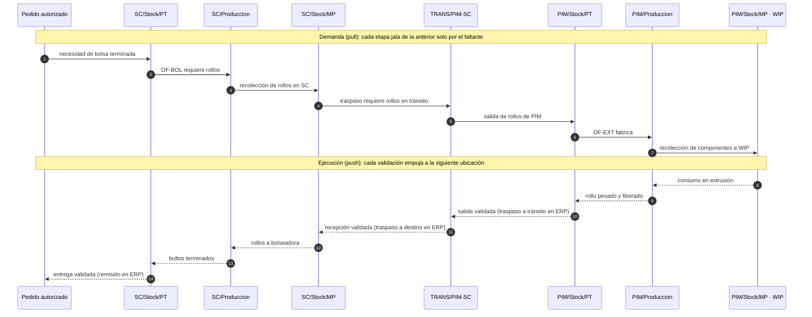

# Almacenes, ubicaciones y tipos de operación

Motor logístico de PolyConecta: dónde vive el material, qué operaciones lo mueven y cuáles escriben en CONTPAQi. Sigue la arquitectura logística de Odoo 19: almacenes, ubicaciones físicas y virtuales, tipos de operación y reglas push/pull.

## 1. Las ubicaciones las define PolyConecta (D-43)

- **PolyConecta es dueño del catálogo de ubicaciones.** CONTPAQi no dicta los códigos.
- Al **inicializar** el sistema por primera vez, **todas** las ubicaciones se reservan como almacenes en `admAlmacenes`, incluidas las virtuales (producción, tránsito, clientes y proveedores). Cada `StockLocation` guarda el id del almacén que le corresponde.
- La convención es `{PLANTA}/{estructura}/{sububicación}`, con los códigos de planta `PIM`, `SC` y `MTM`.
- Hay dos verificaciones pendientes: si el SDK puede dar de alta almacenes (T-10) y cómo se registran el consumo, la remisión y la compra cuando `Produccion`, `Customers` y `Vendors` también son almacenes (T-11). Ver [preguntas-abiertas.md](preguntas-abiertas.md).

## 2. Plantas

| Código | Planta | Razón social | Función |
| :--- | :--- | :--- | :--- |
| `PIM` | Parque Industrial Monterrey (Apodaca) | Polyempaques | Extrusión de rollos maestros y abasto de resinas |
| `SC` | Santa Cruz (Guadalupe) | Polyempaques | Conversión: impresión, bolseo, corte, suaje y empaque |
| `MTM` | Montemorelos | Empresa filial | Se modela, pero sus rutas son de Fase 2 (D-47) |

La entidad legal se **deriva** de la planta: PIM y SC comparten razón social; MTM no.

## 3. Ubicaciones

| Ubicación | Tipo | Significado |
| :--- | :--- | :--- |
| `PIM/Stock/MP` | Física | Resinas, pigmentos y aditivos disponibles |
| `PIM/WIP` | Física | MP apartada para producir; sigue siendo inventario, pero no está disponible |
| `PIM/Produccion` | Virtual | Entrar aquí es **consumo** |
| `PIM/Stock/PT` | Física | Rollos maestros pesados, liberados y lotificados |
| `PIM/Stock/Cuarentena` | Física | Lotes rechazados (sufijo `.S`) |
| `PIM/Stock/Scrap` | Física | Merma de extrusión por resina y color |
| `TRANS/PIM-SC` | Virtual | Rollos viajando de Apodaca a Guadalupe |
| `TRANS/PIM-MTM` | Virtual | Cruce intercompany (Fase 2) |
| `SC/Stock/MP` | Física | Rollos recibidos en espera de conversión |
| `SC/WIP` | Física | Rollos apartados para conversión |
| `SC/Produccion` | Virtual | Consumo en impresión y bolseo |
| `SC/Stock/PT` | Física | Bultos y cajas terminados (lote `C001-IV310-26`) |
| `SC/Stock/Cuarentena` | Física | Bultos o cajas retenidos por Calidad |
| `SC/Stock/Scrap` | Física | Merma de suaje, troquel y refile |
| `Vendors` | Externa | Origen de compras de MP |
| `Customers` | Externa | Destino de remisiones |

Hay **un WIP por planta**, no uno por orden. La liga con la orden es un atributo de la reserva, lo que permite reasignar material sin moverlo físicamente.

El prototipo usa dos alias fuera de la convención, `PIM/Cuarentena` y `SC/Scrap`. Se renombran a `PIM/Stock/Cuarentena` y `SC/Stock/Scrap`.

## 4. Tipos de operación

| Código | Operación | Origen → Destino | Escritura en CONTPAQi |
| :--- | :--- | :--- | :--- |
| `PIM-REC-OUT` | Recolección de MP | `PIM/Stock/MP` → `PIM/WIP` | Traspaso al validar |
| `PIM-REC-RET` | Devolución de componentes | `PIM/WIP` → `PIM/Stock/MP` | Traspaso inverso al validar |
| `PIM-MO` | Fabricación extrusión | `PIM/WIP` → `PIM/Stock/PT` | Consumo de MP (desde WIP) + entrada de PT **al cierre técnico** |
| `PIM-TR-OUT` | Salida a tránsito | `PIM/Stock/PT` → `TRANS/PIM-SC` | Traspaso a tránsito al validar |
| `SC-TR-IN` | Recepción de traspaso | `TRANS/PIM-SC` → `SC/Stock/MP` | Traspaso de tránsito a destino al validar |
| `SC-WIP-OUT` | Surtido de rollos a conversión | `SC/Stock/MP` → `SC/WIP` | Traspaso al validar |
| `SC-WIP-RET` | Devolución de rollos | `SC/WIP` → `SC/Stock/MP` | Traspaso inverso al validar |
| `SC-IMP-MO` | Fabricación impresión | `SC/WIP` → rollo impreso | Consumo de rollo liso y tintas + entrada de rollo impreso al cierre |
| `SC-BOL-MO` | Fabricación bolseo | `SC/WIP` → `SC/Stock/PT` | Consumo de rollo + entrada de bolsa PT al cierre |
| `PIM-OUT-DIR` | Despacho directo de rollo | `PIM/Stock/PT` → `Customers` | Remisión de venta al validar |
| `SC-OUT-DIR` | Despacho directo de bolsa | `SC/Stock/PT` → `Customers` | Remisión de venta al validar |
| `ICO-TR-OUT` | Salida intercompany | `PIM/Stock/PT` → `TRANS/PIM-MTM` | Fase 2 |

Los tipos de operación son un **catálogo** (`OperationType`) con origen y destino por defecto, la bandera "requiere liberación de calidad" y el documento ERP que disparan. Agregar una ruta nueva es un registro, no código. El patrón de recolección y devolución es universal y está parametrizado por almacén.

## 5. Cuándo se escribe en CONTPAQi

1. **Fabricación**: el consumo de MP y la entrada de PT se registran **solo al cierre técnico**, en un único movimiento consolidado. El consumo se descuenta **desde WIP**.
2. **Recolección y devolución**: se registran al validar, como traspaso entre almacenes (MP ↔ WIP).
3. **Traspaso interplanta**: se registra en **dos traspasos**. La salida (origen → tránsito) se registra al validar en origen, y la recepción (tránsito → destino) al validar en destino. Como el tránsito es un almacén en CONTPAQi, el material en camino se ve en el ERP como existencia en `TRANS/PIM-SC` (D-43). Invariante: el material permanece en tránsito hasta que el destino valida la entrada.
4. **Venta**: la remisión se registra **solo al validar el despacho**.

Todo depende de que el SDK soporte cada movimiento con lote y cantidad fraccionada. Se verifica con la [matriz de pruebas del SDK](../contpaq/MATRIZ_PRUEBAS_SDK_WIP_LOTES.md) antes de construir (Principio VII).

## 6. Reglas push y pull

- **Pull (jalar)**: una necesidad en destino (una OF, un pedido) jala material desde el origen anterior. Es lo que ejecuta el motor de abastecimiento al autorizar.
- **Push (empujar)**: completar una etapa empuja el material a la siguiente ubicación. Un rollo liberado pasa a `Stock/PT`, uno rechazado a `Stock/Cuarentena` y el scrap del cierre a `Stock/Scrap`.

## 7. Centros de trabajo

El catálogo real lo **levantan los Planners** (D-44; dato de puesta en marcha, D-75). Como referencia, la capacidad instalada que se documentó al inicio:

| Planta | Proceso | Máquinas | Capacidad nominal | Setup típico |
| :--- | :--- | :---: | :--- | :--- |
| PIM | Coextrusión 3 capas | 2 | 180–220 kg/h | 45–60 min |
| PIM | Monocapa | 2 | 120–140 kg/h | 30 min |
| SC | Impresión flexo 1–6 tintas | 5 | 350 m/min | 90 min |
| SC | Bolseo camiseta + suaje | 10 | 12 millares/h | 20 min |
| SC | Bolseo sello fondo o lateral | 8 | 8 millares/h | 25 min |
| SC | Bolseo especial | 6 | 6 millares/h | 35 min |

Ninguna línea de planeación se asigna sin máquina concreta y sin fecha de inicio y fin.
