# Modelo de dominio

Modelo **objetivo** de `PolyConecta.Domain`. Consolida la redefinición del dominio (con su revisión 4 del 18–19 de septiembre, basada en la transcripción de la reunión y en los mockups de pantallas, ya retirados del repositorio) con las entidades de abastecimiento, recolección, roles y búsqueda. La sección 5 compara este modelo con lo que existe hoy en el código.

## 1. Principios de modelado

- **Mixins, no campos repetidos.** Toda entidad de negocio hereda `AuditableEntity` (id técnico inmutable, creado y modificado por quién y cuándo) y `ArchivableEntity` (`is_active`, verdadero por defecto).
- **Origen opcional (D-52).** Ningún documento exige un documento de origen para existir. Las referencias al origen (`sales_order_line_id`, `origin_order_id`, el origen de un `StockPicking`) son anulables, y las reglas del documento no dependen de que estén llenas.
- **No se borra lo referenciado.** Un registro de negocio que otro referencia se archiva; no se elimina.
- **Estados cerrados con transiciones nombradas.** Todo documento con ciclo de vida tiene un estado enumerado cerrado y cambia solo mediante operaciones con precondiciones, nunca editando el campo. Cada transición se registra en `StateTransitionLog`: entidad, id, estado origen y destino, usuario, rol ejercido, fecha y nota.
- **Delegación 1:1 para especializaciones.** Los atributos físicos por categoría viven en entidades delegadas de `Product` (`RawMaterialCatalog`, `RollSpecification`, `PtSpecification`), no como columnas nulas en `Product`.
- **Multiempresa por derivación.** La entidad legal se resuelve `LegalEntity ← Plant ← entidad operativa`; no se copia un `legal_entity_id` en cada tabla.
- **Numeración centralizada.** Todo folio visible (pedido, orden, lote, QC, operación) sale de `IReferenceSequenceService`, configurable por tipo de documento; nunca se arma concatenando cadenas.
- **KG como unidad base.** Todo cálculo interno se hace en kilogramos (ver [02-flujo-y-reglas.md §6](02-flujo-y-reglas.md)).
- **Ninguna entidad llama a CONTPAQi.** Las escrituras al ERP se encolan en el outbox (`IBridgeSyncService`).

## 2. Mapa de entidades

```mermaid
erDiagram
    LegalEntity ||--o{ Plant : owns
    Plant ||--o{ WorkCenter : hosts
    Plant ||--o{ StockLocation : hosts
    Plant ||--o{ Operator : employs

    Customer ||--o{ SalesOrder : places
    SalesOrder ||--|{ SalesOrderLine : "maestro/detalle CONTPAQi"
    SalesOrder ||--o{ AuthorizationSignature : "2 firmas"
    SalesOrderLine }o--|| Product : "vende PT"
    SalesOrderLine }o--|| PackagingUnit : "unidad de venta"
    SalesOrderLine }o--o| ProcurementRoute : "ruta forzada por AC"

    Product ||--o| RawMaterialCatalog : delega
    Product ||--o| RollSpecification : delega
    Product ||--o| PtSpecification : delega
    PtSpecification ||--|| RollSpecification : "siempre ligado"
    Product ||--|{ PackagingUnit : configura
    Product }o--o| ProductClassification : clasifica
    RawMaterialCatalog ||--o{ SupplierProductMapping : "códigos de proveedor"

    ProcurementRoute ||--|{ ProcurementRule : "reglas ordenadas"
    ProcurementRoute ||--o{ RouteAssignment : "clasificación / producto"
    ProcurementPlan ||--|{ ProcurementNeed : resuelve
    ProcurementNeed ||--o{ ProcurementDocument : genera
    StockReservation }o--|| StockLot : compromete

    SalesOrderLine ||--o{ ManufacturingOrder : "orden raíz"
    ManufacturingOrder ||--o{ ManufacturingOrder : "OriginOrderId"
    ManufacturingOrder ||--|{ ComponentLine : componentes
    ManufacturingOrder ||--o{ SubProductLine : subproductos
    ManufacturingOrder ||--o{ PlanningLine : planeación
    PlanningLine }o--|| WorkCenter : "asignada a"
    ManufacturingOrder ||--o{ ProductionSlot : precarga
    ProductionSlot ||--o| StockLot : "pesado como"
    ManufacturingOrder ||--o{ QualityControl : inspecciona
    QualityControl ||--|{ QualityControlLine : "control por lote"
    QualityControlLine }o--|| StockLot : evalúa
    ManufacturingOrder ||--o{ ScrapEntry : genera
    ScrapEntry }o--|| ScrapReasonCode : motivo
    ManufacturingOrder ||--o| MassBalanceAudit : "cierra con"
    StockLot ||--o{ LotGenealogy : "consumo padre/hijo"

    OperationType ||--o{ StockPicking : configura
    StockPicking ||--|{ StockMove : agrupa
    StockPicking ||--o| StockPicking : backorder
    StockMove }o--o| StockLot : mueve
    ManufacturingOrder ||--o| StockPicking : "recolección a WIP"
    WipBalance }o--|| ManufacturingOrder : "saldo por OF"

    Incident }o--|| WorkCenter : "paro en"
    Incident }o--|| IncidentType : tipo

    User ||--o{ RoleAssignment : tiene
    RoleAssignment }o--|| Role : rol
    RoleAssignment }o--|| Plant : alcance
    Role ||--o{ Permission : "documento × acción"
    Role ||--o{ RecordRule : "filtro de fila"
```

## 3. Entidades por área

### Organización

| Entidad | Propósito | Campos clave |
| :--- | :--- | :--- |
| `LegalEntity` | Razón social | `name`, `tax_id` |
| `Plant` | Planta | `code` (`PIM`, `SC`, `MTM`), `legal_entity_id` |
| `WorkCenter` | Máquina o estación | `code`, `plant_id`, `process_type`, `capacity_kg_per_hour` |
| `Operator` | Operador de máquina: es un dato de planeación y producción, no un usuario del sistema (D-39) | `code`, `name`, `plant_id` |
| `StockLocation` | Ubicación | `code` (`PIM/Stock/MP`), `plant_id`, `usage` (`Internal`, `Wip`, `Production`, `Transit`, `Quarantine`, `Customer`, `Vendor`), `erp_warehouse_id`: el almacén que se reserva en `admAlmacenes` al inicializar, para toda ubicación salvo `Vendors` (D-43, D-96) |
| `OperationType` | Catálogo de operaciones | `code`, origen y destino por defecto, `requires_quality_release`, `triggers_erp_document_type` |

### Catálogo de productos

| Entidad | Propósito |
| :--- | :--- |
| `Product` | Identidad única de catálogo: `sku`, `name`, `category` (`RawMaterial`, `Additive`, `Pigment`, `Recycled`, `IntermediateRoll`, `FinishedGood`, `ScrapMaterial`), `base_uom = KG`, `erp_product_id` |
| `PackagingUnit` | Unidades de venta del producto: `code` (`KG`, `MIL`, `PZA`, `ROLLO`, `BULTO25`), `conversion_to_kg`, `is_default_sales_unit` |
| `ProductClassification` | Clasificación que agrupa el visor de disponibilidad y la herencia de rutas. Es de PolyConecta: la de CONTPAQi no distingue bolsa, rollo impreso, liso y maestro (D-86) |
| `RawMaterialCatalog` | MP estandarizada entre plantas (Principio III): `mfi_melt_flow_index`, `density_g_cm3`, `target_hopper` |
| `SupplierProductMapping` | Códigos de proveedor que apuntan a la MP estándar |
| `ScrapReasonCode`, `IncidentType` | Catálogos cerrados |

**Ficha técnica.** Los campos coinciden 1:1 con el formato real de captura de Atención a Clientes.

| `RollSpecification` (bloque Rollo) | `PtSpecification` (bloque PT) |
| :--- | :--- |
| Tipo de material | `related_roll_specification_id` (obligatorio: el mismo rollo o el de 2.º proceso) |
| Tipo / medida del rollo | No. de parte del cliente |
| Calibre (micras) | Medida final |
| Kg por rollo | Tintas |
| Tratado (corona, dynes/cm) | Pantones |
| Pigmento | Suaje |
| Aditivo | Empaque |
| Perforación | Tipo de sello |
| Impresión preliminar | Kg por millar (factor de ficha) |

El PT no siempre es una bolsa: puede ser el mismo rollo vendido tal cual, por eso el bloque se llama `PtSpecification`.

### Comercial

| Entidad | Propósito |
| :--- | :--- |
| `Customer` | Sincronizado de solo lectura desde CONTPAQi |
| `SalesOrder` | `erp_document_id` (Contpaq ID, solo lectura; lo asigna la sincronización o el alta del pedido libre, D-53), `origin` (`Sync` o `Manual`), `customer_id`, `customer_po`, `agent`, `promise_date`, `state` (`Draft`, `Confirmed`, `Authorized`, `InProgress`, `Done`, `Cancelled`) |
| `SalesOrderLine` | `erp_document_line_id`, `product_id`, `requested_qty`, `requested_packaging_unit_id`, `requested_qty_kg` (calculado), `target_production_kg`, `tolerance_percentage_override`, ruta forzada opcional |
| `AuthorizationSignature` | Firma de un pedido: rol (`Comercial` o `Cobranza`), usuario, fecha. Hay una por rol y los dos usuarios deben ser distintos |

`SalesOrderLine` tiene además `unit_price` y `currency`, que solo se llenan en el pedido libre (D-74). IVA, descuentos y totales viven en CONTPAQi.

### Abastecimiento

| Entidad | Propósito |
| :--- | :--- |
| `ProcurementRoute` | Secuencia de reglas; marca MTSO (consume existencia primero) o MTO |
| `ProcurementRule` | Acción, origen, destino, tipo de operación y orden |
| `RouteAssignment` | Ruta asignada por clasificación o por producto (la de la línea vive en `SalesOrderLine`) |
| `ProcurementNeed` | Necesidad a resolver: producto, cantidad, ubicación y nivel en la cascada |
| `ProcurementDocument` | Documento generado por una regla, con su nivel |
| `ProcurementPlan` | Resultado completo, simulado o ejecutado |
| `StockAvailability` | Proyección: físico, reservado, WIP, disponible y entrante con fecha |
| `StockReservation` | Compromiso firme lote ↔ documento; ningún lote se compromete dos veces |
| `SubstitutionDecision` | Evidencia de sustitución: SKU vendido, lote usado, motivo y autor |
| `LotReassignment` | Fraccionamiento de kg entre lotes |

### Manufactura

| Entidad | Propósito |
| :--- | :--- |
| `ManufacturingOrder` | Orden única y autorreferenciada: `name` (`BOL/2026/0001`), `origin_order_id` (nulo en la raíz), `sales_order_line_id` (opcional, solo en la raíz; nulo en producción para stock), `plant_id`, `process_type` (`Extrusion`, `Printing`, `Bagging`), `product_id`, `target_qty`, `unit`, `state` |
| `ComponentLine` | Lista plana de componentes: clave, producto, cantidad, unidad |
| `SubProductLine` | Producto de scrap que resulta del proceso: cantidad, unidad, producido, almacén destino |
| `PlanningLine` | Centro de trabajo, cantidad, unidad, inicio, fin y operador |
| `ProductionSlot` | Un slot por rollo proyectado, precargado al confirmar la orden |
| `StockLot` | `name` calculado (`R001-IV310-26`, o `R001-BOL-2026-0007` si la OF no tiene pedido; sufijo `.S` en cuarentena), `sequence_number`, pesos bruto, tara y neto, `state` (`Available`, `Quarantine`, `Consumed`, `ScrappedOut`), `current_location_id`. Corresponde al **número de lote** de CONTPAQi, que puede tener varias capas por almacén (D-83) |
| `QualityControl` | Documento `QC/2026/000X`: orden, auditor, proceso y `state` (`Planeado`, `Aprobado`, `Parcial`, `Rechazado`) |
| `QualityControlLine` | Producto, lote, cantidad planeada, cantidad real y resultado aprueba o falla |
| `ScrapEntry` | Kg de scrap por producto y motivo |
| `MassBalanceAudit` | Un único registro al cierre: entrada, rollos buenos, cuarentena, scrap, varianza, tolerancia aplicada y resultado |
| `LotGenealogy` | Qué lote padre se consumió en qué lote hijo. CONTPAQi no guarda linaje entre capas, así que esta tabla y los `StockMove` son la única trazabilidad (D-83) |
| `Incident` | Paro: fecha, centro de trabajo, tipo, comentarios, hora de inicio y de fin. Lo captura el Supervisor de turno |

Estados de `ManufacturingOrder` (D-42): `Borrador → Confirmada → En progreso → Por cerrar → Hecha`, y `Cancelada`. El prototipo todavía usa `Borrador / Planeado / En progreso / Hecho`.

### Inventario

| Entidad | Propósito |
| :--- | :--- |
| `StockPicking` | Operación (recolección, devolución, traslado, recepción o entrega) con `operation_type_id`, origen, destino, estado y enlace al backorder. El backorder no tiene contraparte en CONTPAQi (D-85); un traspaso validado se refleja como un par Salida + Entrada (D-79) |
| `StockMove` | Línea: producto, lote, cantidad solicitada y cantidad hecha acumulada |
| `WipBalance` | Saldo vivo por SKU en WIP, asignado a una OF o **sin asignar** (recolección libre, D-55); bloquea el cierre técnico de la OF si le queda saldo |

### Seguridad y auditoría

| Entidad | Propósito |
| :--- | :--- |
| `User` | Persona con credenciales propias de PolyConecta (ASP.NET Identity, D-32), activa o archivada |
| `Role` | Conjunto nombrado de permisos |
| `RoleAssignment` | Usuario × Rol × Planta, con bandera de suplente (D-38) |
| `Permission` | Rol × tipo de documento × acción |
| `RecordRule` | Filtro de fila reutilizable por rol |
| `StateTransitionLog` | Quién, qué, cuándo y con qué rol, sobre qué documento |
| `ChatterMessage` | Mensaje, nota interna o registro automático de cambio de estado, por documento: autor, tipo, cuerpo y fecha (D-78) |

### Configuración de interfaz

`SearchView` (campos, filtros y agrupaciones por modelo), `SavedSearch` (favoritos por usuario y modelo).

## 4. Servicios de dominio

| Servicio | Responsabilidad |
| :--- | :--- |
| `IReferenceSequenceService` | Folios por tipo de documento (prefijo, relleno, reinicio) |
| `IMassBalanceService` | Balance de masa con tolerancia configurable |
| `IProcurementEngine` | Resolver rutas, simular y ejecutar el plan al autorizar |
| `IBridgeSyncService` | Encolar escrituras a CONTPAQi en el outbox |
| `IIntercompanyMirrorService` | Punto de extensión para Fase 2, sin implementar |

## 5. Diferencia con el código actual

Hoy `PolyConecta.Domain` contiene: `Product`, `StockLot`, `ManufacturingOrder` (autorreferenciado con `ParentId`), `Bom` y `BomLine` (con capas A/B/C), `StockLocation`, `PolyLocation`, `StockPicking` y `StockMove`, `QualityCheck` y `StockScrap`, `RawMaterialCatalog` y `SupplierProductMapping`, `MassBalanceAudit` con `MassBalanceService`, `LotGenealogy`, `OutboxMessage` y el value object `Folio`.

Ya se retiraron los duplicados legados (`MasterOrder`, `SubOrder`, `RolloMaestro`). Falta:

- Mixins de auditoría y archivado, estados cerrados con transiciones y `StateTransitionLog`.
- `SalesOrder`, `SalesOrderLine`, `AuthorizationSignature`, `Customer`, `PackagingUnit` y la ficha técnica (`RollSpecification`, `PtSpecification`).
- `ComponentLine` plana (sustituye a `BomLine` por capas), `SubProductLine`, `PlanningLine`, `ProductionSlot`, `QualityControl`, `ScrapEntry` con catálogo de motivos, `Incident`.
- Toda el área de abastecimiento, `WipBalance`, el backorder en `StockPicking` y la seguridad.
- Unificar `PolyLocation` y `StockLocation`, y sustituir el value object `Folio` por `IReferenceSequenceService`.

Las pantallas del prototipo modelan casi todo esto con clases propias en `PolyConecta.Presentation/Services/` (`OperationalFlowState`, `StockOperationState`, `InventoryState`). Sirven de referencia de comportamiento, no de modelo.
