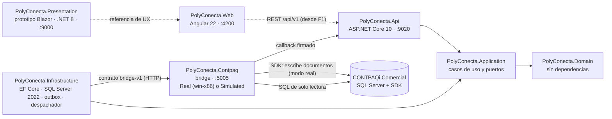

# Arquitectura técnica

Cómo está armada la solución, qué hace hoy cada proyecto y qué deuda técnica hay que resolver antes de construir. Las reglas que gobiernan todo esto están en la [constitución](../../.specify/memory/constitution.md).

## 1. Principios que condicionan la arquitectura

| Principio | Consecuencia técnica |
| :--- | :--- |
| I · CONTPAQi es el sistema de registro | PolyConecta no factura ni guarda saldos contables oficiales; los refleja. No se despliega Odoo: solo se imita su experiencia. |
| II · Sincronización asíncrona con outbox | Toda escritura a CONTPAQi pasa por un outbox y un bridge x86 de un solo hilo con el SDK de Comercial, `MGWServicios.dll` (D-88, constitución 1.6.1). **Prohibido** hacer `INSERT` o `UPDATE` directo en tablas `adm*`. La planta nunca espera un bloqueo del ERP. |
| III · Catálogos | La MP es un catálogo único entre plantas; el PT puede tener código por cliente. |
| IV · Balance de masa y hard-stop | Tolerancia configurable, auditoría obligatoria por corrida y ningún movimiento sin liberación de Calidad. |
| VI · Alcance de Fase 1 | No hay handheld, terminal ni escáner: el Planner captura en la aplicación web. Montemorelos, el intercompany, el peletizado y la báscula IoT quedan para la Fase 2. |
| VII · Respaldo técnico | Toda decisión de SDK o BD se respalda en `docs/contpaq/` o en documentación oficial verificada. |
| VIII · Realidad de CONTPAQi | El modelo se contrasta con las tablas `adm*` reales antes de ratificarse. |
| IX · Odoo 19 como referencia de UX | Kanban, lista y formulario, pipeline de estado, smart buttons y chatter. |

## 2. Solución

`Polyconecta.slnx` · **.NET 10** (SDK 10.0.300 en `global.json`), versiones exactas en `Directory.Packages.props` (CT-36). La única excepción es `PolyConecta.Presentation`, que sigue en .NET 8 porque el prototipo no se modifica (D-60).



La flecha punteada de la web a la API es de F1 en adelante: en F0 la aplicación web solo tiene su estructura, su navegación y sus componentes. El resto ya existe.

## 3. Estado real de cada proyecto

| Proyecto | Qué hace hoy | Destino |
| :--- | :--- | :--- |
| `PolyConecta.Domain` | Base común (04 §1): `AuditableEntity`, `ArchivableEntity`, `DocumentoConEstado` con transiciones nombradas y `SyncState` (CT-15). En `Plataforma/`: `StateTransitionLog`, `ReferenceSequence` y `OutboxMessage`. Las entidades previas a F0 siguen en `Entities/` sin rediseñar | Modelo de 04 por fase |
| `PolyConecta.Application` | Casos de uso con decoradores propios (registro → validación → transacción, D-72). Puertos: `IUnitOfWork`, `IClock`, `ICurrentUser` (es "sistema" hasta F1), `IReferenceSequenceService` e `IBridgeSyncService`. Casos de uso `ConfirmarSincronizacion` y `ReintentarSincronizacion` | Un caso de uso por acción de negocio |
| `PolyConecta.Infrastructure` | `PolyDbContext` en **SQL Server 2022**, un esquema por módulo (`plt`, `inv`, `prd`, `cal`) y migraciones (`F0_Base`, `F0_Plataforma`). Interceptor de auditoría y bitácora, filtro de archivado, folios con `UPDLOCK`. En `Erp/`: traductores al contrato, cliente HTTP del bridge, verificación de firma y **despachador** (orden, espera por llave, bloqueo por error, reintentos y consulta si no llega el callback) | Persistencia y traductores de cada fase |
| `PolyConecta.Api` | Controladores previos a F0 (`Orders`, `Rolls`, `RawMaterials`, `Locations`) sobre SQL Server; callback del bridge (`/api/v1/plataforma/bridge/callbacks`) y reintento manual (`/api/v1/plataforma/outbox/{id}/reintentar`); `X-Correlation-ID` (CT-31) | Contrato por caso de uso, autenticación (F1) |
| `PolyConecta.Web` | Angular 22: estilos del prototipo, layout, barra superior, rutas por módulo y 12 componentes compartidos (spec 001, fases 0 y 2A) | Páginas de la spec 001 y de cada fase |
| `PolyConecta.Presentation` | **Prototipo navegable** en Blazor Server, sin cambios (D-60) | Referencia hasta conectar Angular a la API |
| `PolyConecta.Contpaq` | Bridge con el contrato `bridge-v1`: sobre 1.0, validaciones de CT-39 y D-127, `OutboxWorker` en un hilo STA, callback firmado, lecturas del contrato. **Modo simulado** (`BridgeConfig__Mode=Simulated`, por omisión fuera de Windows) con catálogo semilla, folios por concepto y fallos configurables. En **modo real** los comandos se implementan en su fase (2.4, 3.1, 3.2, 5.1, 6.1) | Comandos reales con ejecución por pasos (CT-38) |
| `tests/` | Dominio, aplicación e integración contra SQL Server con Testcontainers; bridge; **suite de contrato** por HTTP (CT-23) y ciclo completo, que necesitan `BRIDGE_URL` | Una prueba por regla (CT-28) |
| `tools/sdk-lab` | **Retirado** (D-130): registro de cómo se corrió la matriz del SDK. El desarrollo contra el SDK real se hace con el bridge en modo debug en el VPS (`PolyConecta.Contpaq/AGENTS.md`) | Solo consulta |

## 4. Sincronización con CONTPAQi

Cómo viaja una escritura del documento al ERP. Las reglas son CT-13 a CT-21, CT-38 a CT-41 y D-95; el formato de los mensajes está en el [contrato `bridge-v1`](../contratos/bridge-v1.md).

**Outbox (`plt.OutboxMessage`).** El caso de uso inserta el mensaje en el mismo `SaveChanges` que el cambio de negocio: si el negocio falla, no queda mensaje (CT-20). Cada mensaje lleva:
- `Sequence` (`IDENTITY`), que fija el orden de envío (CT-41);
- `IdempotencyKey` `{tipo}:{id}:{transición}`, única (CT-19);
- `LockKeys`: los `producto:<código>` y `almacen:<código>` de la carga, para D-95;
- estado `Pendiente`, `Enviado`, `Confirmado`, `Error` o `Bloqueado`, intentos, `BridgeTransactionId` y último error.

**Despachador (`Infrastructure/Erp/BridgeDispatcher`).**
1. Toma el `Pendiente` de menor secuencia que no comparta llaves con uno `Enviado` o `Error`. Los que comparten pasan a `Bloqueado`: un error detiene solo a los que tocan los mismos productos o almacenes (D-95).
2. Lo envía. Con `202` queda `Enviado`, y no sale otro con llaves en común hasta el callback terminal.
3. Si la red falla o el bridge responde `5xx`, reintenta con espera de 2ⁿ segundos hasta `Erp__MaxIntentos` (5). Al agotarlos, el documento queda en `Error`.
4. Si el callback no llega en `Erp__CallbackTimeoutSegundos` (120), consulta `GET /api/v1/transactions/{id}`.
5. Un bloqueo de aplicación de SQL Server (`sp_getapplock`) garantiza un solo despachador aunque haya varias instancias de la API.

Sistemas reintenta un `Error` con `ReintentarSincronizacion` (D-93): vuelve a `Pendiente` con la misma `IdempotencyKey` y libera a los `Bloqueado` que dependían de él.

**Callback (`POST /api/v1/plataforma/bridge/callbacks`).** Es el `callback_url` de cada comando, con base en `Erp__CallbackBaseUrl`.

| Caso | Respuesta |
| :--- | :--- |
| Sin `X-Bridge-Signature`, firma distinta de `HMAC-SHA256(Erp__CallbackSecret, t + "." + cuerpo crudo)` o `t` a más de 5 minutos | `401` |
| Cuerpo fuera del esquema del callback | `400` |
| `idempotency_key` desconocida | `404`, registrado con su `correlation_id` |
| Mensaje ya `Confirmado`, o estado no terminal (`PENDING`, `PROCESSING`) | `200` sin cambios |
| `CONFIRMED` | `200`: guarda folio, id y `documentos[]` en el `SyncState`, confirma y libera a los `Bloqueado` |
| `FAILED` o `DEAD_LETTER` | `200`: guarda el error y pasa a `Error`; los que comparten llaves siguen bloqueados |

Un `5xx` hace que el bridge reintente la entrega. Los dos últimos casos los hace `ConfirmarSincronizacion` en una transacción.

**Bridge (SQLite).** `bridge_transactions` guarda cada comando con su versión de contrato, variante, resultado y error del contrato; `transaction_logs`, su bitácora; `webhook_deliveries`, cada intento de callback. En modo simulado, `simulated_folio`, `simulated_id` y `simulated_almacen` dan folios por concepto, ids y almacenes. Borrar una transacción borra antes sus filas hijas. En modo real la sesión del SDK se abre solo cuando hay transacciones pendientes y se cierra tras `IdleSessionTimeoutSeconds` sin trabajo.

**Pruebas.** Las de integración usan SQL Server 2022 con Testcontainers: un contenedor por corrida y una base por clase, creada con las migraciones (CT-06). La suite de contrato (`tests/PolyConecta.Contract.Tests`) no referencia otros proyectos, corre por HTTP contra cualquier bridge y omite las pruebas con el rasgo `Simulado` contra el real (CT-23).

## 5. Deuda técnica conocida

1. **Credencial en el historial.** La contraseña de `sa` estuvo versionada hasta el 28-sep y el historial no se reescribe (D-51). El bridge ya no usa `sa`: lee con el login de solo lectura `polyconecta_bridge_ro`, creado el 6-oct, y toma su cadena de `BridgeConfig__SqlConnectionString`. **`sa` no se rota por ahora**, porque CONTPAQi se conecta con ella (D-129); falta el procedimiento para cambiarla en SQL Server y en CONTPAQi a la vez (H-04).
2. ~~Sin persistencia real~~. Resuelta en F0: SQL Server 2022 con migraciones y logins separados (CT-30).
3. **La UI no usa el backend.** El prototipo duplica en `Presentation/Services` la lógica que debería vivir en el dominio. La aplicación Angular se conecta a la API desde F1.
4. **Gateway real del SDK.** El bridge real todavía no implementa los comandos del contrato; la ejecución por pasos con reconciliación (D-80, CT-38), los N lotes por movimiento (D-82), el par Salida + Entrada (D-79), la sesión de larga duración con doble inicio de sesión (D-91, D-108) y la verificación posterior (CT-39) llegan con cada comando.
5. ~~Sin CI~~. Resuelta en F0: GitHub Actions con los trabajos `dotnet`, `contrato` y `web` (CT-27). `main` está protegida desde el 6-oct: exige PR y los tres checks en verde, sin excepciones (CT-44).
6. **Supuestos del SDK**: la [matriz](../contpaq/MATRIZ_PRUEBAS_SDK_WIP_LOTES.md) verificó WIP como almacén, lotes múltiples y fraccionados, devolución parcial y parcialidades (D-79 a D-87). Siguen abiertos la frescura de la lectura (T-06) y el costo de la entrada (T-17).
7. **Bridge como proceso interactivo**: el SDK no funciona como servicio de Windows (S-03, D-108). Corre sin ventana en la sesión del administrador, con inicio de sesión automático y la tarea `PolyConecta-Bridge` (D-115). Medido el 6-oct: escucha 0.8 min después de arrancar Windows. Los scripts están en `scripts/vps/`.

## 6. Cómo correrlo

Requisitos: SDK de .NET 10 (`global.json`), el runtime de ASP.NET Core 8 para el prototipo, Docker y Node 24.16 (`PolyConecta.Web/.nvmrc`).

```bash
./run.sh                 # compila, prueba y levanta Presentation (:9000) + API (:9020)
./run.sh --with-bridge   # además levanta el bridge (:5005), en modo simulado fuera de Windows, conectado a la API
cd PolyConecta.Web && npm ci && npm start   # aplicación Angular (:4200)
```

Sin `ConnectionStrings__PolyConecta`, `run.sh` levanta un SQL Server 2022 local en Docker (`polyconecta-sql`, puerto 14333), crea los logins de `scripts/sql/logins-desarrollo.sql` con contraseñas generadas en `.env.local` y aplica las migraciones con `dotnet ef` (herramienta local en `dotnet-tools.json`).

La suite de contrato y el ciclo completo corren contra un bridge levantado:

```bash
BRIDGE_URL=http://localhost:5005 BRIDGE_CALLBACK_SECRET=<el de BridgeConfig__CallbackSecret> \
  dotnet test --project tests/PolyConecta.Contract.Tests
```

| Script | Uso |
| :--- | :--- |
| `scripts/build.sh` | Empaqueta el bridge para Windows x86 |
| `scripts/deploy.sh` | **Obsoleto**: publicaba en IIS, que ya no se usa en el VPS |
| `scripts/vps/` | Publicar, arrancar sin ventana, depurar y medir el bridge en el VPS ([README](../../scripts/vps/README.md)) |
| `scripts/screenshots.sh` | Recorre el prototipo con Playwright y guarda capturas en `docs/screenshots/` |
| `scripts/sql/logins-desarrollo.sql` | Base y logins de PolyConecta para desarrollo y CI (CT-30) |
