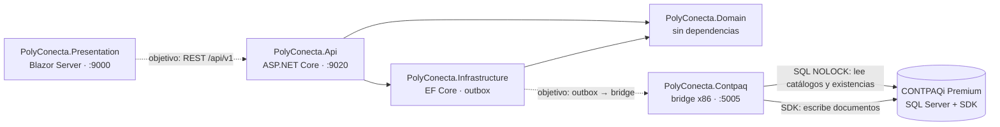

# Arquitectura técnica

Cómo está armada la solución, qué hace hoy cada proyecto y qué deuda técnica hay que resolver antes de construir. Las reglas que gobiernan todo esto están en la [constitución](../../.specify/memory/constitution.md).

## 1. Principios que condicionan la arquitectura

| Principio | Consecuencia técnica |
| :--- | :--- |
| I · CONTPAQi es el sistema de registro | PolyConecta no factura ni guarda saldos contables oficiales; los refleja. No se despliega Odoo: solo se imita su experiencia. |
| II · Sincronización asíncrona con outbox | Toda escritura a CONTPAQi pasa por un outbox y un bridge x86 de un solo hilo con `SDK_CONTPAQ.dll`. **Prohibido** hacer `INSERT` o `UPDATE` directo en tablas `adm*`. La planta nunca espera un bloqueo del ERP. |
| III · Catálogos | La MP es un catálogo único entre plantas; el PT puede tener código por cliente. |
| IV · Balance de masa y hard-stop | Tolerancia configurable, auditoría obligatoria por corrida y ningún movimiento sin liberación de Calidad. |
| VI · Alcance de Fase 1 | Captura en terminal handheld, sin báscula IoT. El intercompany completo y el peletizado quedan para la Fase 2. |
| VII · Respaldo técnico | Toda decisión de SDK o BD se respalda en `docs/contpaq/` o en documentación oficial verificada. |
| VIII · Realidad de CONTPAQi | El modelo se contrasta con las tablas `adm*` reales antes de ratificarse. |
| IX · Odoo 19 como referencia de UX | Kanban, lista y formulario, pipeline de estado, smart buttons, chatter y handheld. |

## 2. Solución

`Polyconecta.slnx` · .NET 8 (el formato `.slnx` requiere SDK 9+ con el runtime ASP.NET Core 8 instalado).



Las flechas punteadas son el diseño objetivo y **todavía no existen**.

## 3. Estado real de cada proyecto

| Proyecto | Qué hace hoy | Destino |
| :--- | :--- | :--- |
| `PolyConecta.Domain` | Entidades Odoo-native parciales (ver [04-modelo-de-dominio.md §5](04-modelo-de-dominio.md)), `MassBalanceService`, interfaces de repositorio | Modelo objetivo completo, con mixins, estados cerrados y servicios de dominio |
| `PolyConecta.Infrastructure` | `PolyDbContext` con configuraciones, repositorios, `OutboxPublisher`, `IUnitOfWork`. Npgsql está referenciado pero no se usa | PostgreSQL con migraciones, outbox transaccional y semillas de catálogos |
| `PolyConecta.Api` | 4 controladores (`Orders`, `Rolls`, `RawMaterials`, `Locations`) sobre **EF InMemory**, Swagger y `ProblemDetailsMiddleware` | Contrato por caso de uso, autenticación, paginación y filtros declarativos |
| `PolyConecta.Presentation` | **Prototipo navegable** en Blazor Server: shell Odoo, 18 páginas, chatter en vivo por SignalR. Todo el estado vive en memoria (`OperationalFlowState`, `StockOperationState`, `InventoryState`); **no llama a la API** y simula los folios de CONTPAQi | Consumir la API, con permisos por rol y vistas de búsqueda declarativas |
| `PolyConecta.Contpaq` | Bridge x86 con outbox SQLite, gateway del SDK con circuit breaker, lecturas SQL, webhooks, DLQ y dashboard | Contrato de movimientos corregido según la matriz del SDK, idempotencia y DLQ recuperable |
| `tests/` | `PolyConecta.Domain.Tests` (8 pruebas) y `PolyConecta.IntegrationTests` (6, API en memoria) pasan. `Contpaq.Bridge.Tests` existe pero **no está en `Polyconecta.slnx`**, así que `run.sh` no lo ejecuta | Todas en la solución y en CI en cada PR |
| `tools/sdk-lab` | Laboratorio para ejecutar la matriz de pruebas contra un CONTPAQi real (Windows) | Se usa en la Fase 0 |

## 4. Deuda técnica conocida

1. **Secretos en el repositorio.** `PolyConecta.Contpaq/appsettings.json` versiona una cadena de conexión con el usuario `sa` y su contraseña. Hay que rotar la credencial, moverla a variables de entorno y limpiar el historial de git.
2. **Sin persistencia real.** La API corre sobre `UseInMemoryDatabase`.
3. **La UI no usa el backend.** El prototipo duplica en `Presentation/Services` la lógica que debería vivir en el dominio.
4. **Gateway del SDK**: el caso G-01 de la matriz (documento huérfano cuando falla el movimiento) está sin resolver.
5. **Sin CI** ni gestión de secretos.
6. **Supuestos del SDK sin verificar**: WIP como almacén, lotes múltiples y fraccionados, devolución parcial, backorder y enlace Remisión ↔ Pedido. Ver la [matriz](../contpaq/MATRIZ_PRUEBAS_SDK_WIP_LOTES.md).

## 5. Cómo correrlo

```bash
./run.sh                 # compila, corre pruebas y levanta Presentation (:9000) + API (:9020)
./run.sh --with-bridge   # además levanta el bridge de CONTPAQi (:5005)
```

`run.sh` delega en `scripts/run.sh`. Otros scripts:

| Script | Uso |
| :--- | :--- |
| `scripts/build.sh` | Empaqueta el bridge para Windows x86 |
| `scripts/deploy.sh` | Despliega el bridge al VPS Windows |
| `scripts/screenshots.sh` | Recorre el prototipo con Playwright y guarda capturas en `docs/screenshots/` |
