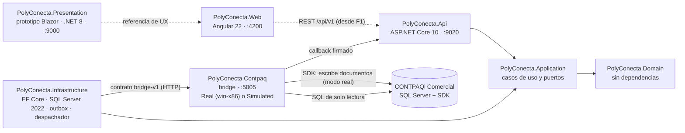

# Arquitectura técnica

Cómo está armada la solución, qué hace hoy cada proyecto y qué deuda técnica hay que resolver antes de construir. Las reglas que gobiernan todo esto están en la [constitución](../../.specify/memory/constitution.md).

## 1. Principios que condicionan la arquitectura

| Principio | Consecuencia técnica |
| :--- | :--- |
| I · CONTPAQi es el sistema de registro | PolyConecta no factura ni guarda saldos contables oficiales; los refleja. No se despliega Odoo: solo se imita su experiencia. |
| II · Sincronización asíncrona con outbox | Toda escritura a CONTPAQi pasa por un outbox y un bridge x86 de un solo hilo con el SDK de Comercial, `MGWServicios.dll` (D-88, constitución 1.6.1). **Prohibido** hacer `INSERT` o `UPDATE` directo en tablas `adm*`. La planta nunca espera un bloqueo del ERP. |
| III · Catálogos | La MP es un catálogo único entre plantas; el PT puede tener código por cliente. |
| IV · Balance de masa y hard-stop | Tolerancia configurable, auditoría obligatoria por corrida y ningún movimiento sin liberación de Calidad. |
| VI · Alcance de Fase 1 | No hay handheld, terminal ni escáner: el Planner captura en la aplicación web. Montemorelos, el intercompany, el peletizado y la báscula IoT quedan para la Fase 2. |
| VII · Respaldo técnico | Toda decisión de SDK o BD se respalda en `docs/contpaq/` o en documentación oficial verificada. |
| VIII · Realidad de CONTPAQi | El modelo se contrasta con las tablas `adm*` reales antes de ratificarse. |
| IX · Odoo 19 como referencia de UX | Kanban, lista y formulario, pipeline de estado, smart buttons y chatter. |

## 2. Solución

`Polyconecta.slnx` · **.NET 10** (SDK 10.0.300 en `global.json`), versiones exactas en `Directory.Packages.props` (CT-36). La única excepción es `PolyConecta.Presentation`, que sigue en .NET 8 porque el prototipo no se modifica (D-60).



La flecha punteada de la web a la API es de F1 en adelante: en F0 la aplicación web solo tiene su estructura, su navegación y sus componentes. El resto ya existe.

## 3. Estado real de cada proyecto

| Proyecto | Qué hace hoy | Destino |
| :--- | :--- | :--- |
| `PolyConecta.Domain` | Base común (04 §1): `AuditableEntity`, `ArchivableEntity`, `DocumentoConEstado` con transiciones nombradas y `SyncState` (CT-15). En `Plataforma/`: `StateTransitionLog`, `ReferenceSequence` y `OutboxMessage`. Las entidades previas a F0 siguen en `Entities/` sin rediseñar | Modelo de 04 por fase |
| `PolyConecta.Application` | Casos de uso con decoradores propios (registro → validación → transacción, D-72). Puertos: `IUnitOfWork`, `IClock`, `ICurrentUser` (es "sistema" hasta F1), `IReferenceSequenceService` e `IBridgeSyncService`. Casos de uso `ConfirmarSincronizacion` y `ReintentarSincronizacion` | Un caso de uso por acción de negocio |
| `PolyConecta.Infrastructure` | `PolyDbContext` en **SQL Server 2022**, un esquema por módulo (`plt`, `inv`, `prd`, `cal`) y migraciones (`F0_Base`, `F0_Plataforma`). Interceptor de auditoría y bitácora, filtro de archivado, folios con `UPDLOCK`. En `Erp/`: traductores al contrato, cliente HTTP del bridge, verificación de firma y **despachador** (orden, espera por llave, bloqueo por error, reintentos y consulta si no llega el callback) | Persistencia y traductores de cada fase |
| `PolyConecta.Api` | Controladores previos a F0 (`Orders`, `Rolls`, `RawMaterials`, `Locations`) sobre SQL Server; callback del bridge (`/api/v1/plataforma/bridge/callbacks`) y reintento manual (`/api/v1/plataforma/outbox/{id}/reintentar`); `X-Correlation-ID` (CT-31) | Contrato por caso de uso, autenticación (F1) |
| `PolyConecta.Web` | Angular 22: estilos del prototipo, layout, barra superior, rutas por módulo y 12 componentes compartidos (spec 001, fases 0 y 2A) | Páginas de la spec 001 y de cada fase |
| `PolyConecta.Presentation` | **Prototipo navegable** en Blazor Server, sin cambios (D-60) | Referencia hasta conectar Angular a la API |
| `PolyConecta.Contpaq` | Bridge con el contrato `bridge-v1`: sobre 1.0, validaciones de CT-39 y D-127, `OutboxWorker` en un hilo STA, callback firmado, lecturas del contrato. **Modo simulado** (`BridgeConfig__Mode=Simulated`, por omisión fuera de Windows) con catálogo semilla, folios por concepto y fallos configurables. En **modo real** los comandos se implementan en su fase (2.4, 3.1, 3.2, 5.1, 6.1) | Comandos reales con ejecución por pasos (CT-38) |
| `tests/` | Dominio, aplicación e integración contra SQL Server con Testcontainers; bridge; **suite de contrato** por HTTP (CT-23) y ciclo completo, que necesitan `BRIDGE_URL` | Una prueba por regla (CT-28) |
| `tools/sdk-lab` | Laboratorio de la matriz del SDK, ya en .NET 10 (`win-x86`). Falta repetir F y G en el VPS (tarea 0.4) | Suite de contrato contra el bridge real |

## 4. Deuda técnica conocida

1. **Credencial en el historial.** La contraseña de `sa` estuvo versionada hasta el 28-sep; el bridge ya la toma de `BridgeConfig__SqlConnectionString`. **Falta rotarla** y crear el login de solo lectura (tarea 0.1, en el VPS). El historial no se reescribe (D-51).
2. ~~Sin persistencia real~~. Resuelta en F0: SQL Server 2022 con migraciones y logins separados (CT-30).
3. **La UI no usa el backend.** El prototipo duplica en `Presentation/Services` la lógica que debería vivir en el dominio. La aplicación Angular se conecta a la API desde F1.
4. **Gateway real del SDK.** El bridge real todavía no implementa los comandos del contrato; la ejecución por pasos con reconciliación (D-80, CT-38), los N lotes por movimiento (D-82), el par Salida + Entrada (D-79), la sesión de larga duración con doble inicio de sesión (D-91, D-108) y la verificación posterior (CT-39) llegan con cada comando.
5. ~~Sin CI~~. Resuelta en F0: GitHub Actions con los trabajos `dotnet`, `contrato` y `web` (CT-27). Falta que un administrador proteja `main` con esos checks.
6. **Supuestos del SDK**: la [matriz](../contpaq/MATRIZ_PRUEBAS_SDK_WIP_LOTES.md) verificó WIP como almacén, lotes múltiples y fraccionados, devolución parcial y parcialidades (D-79 a D-87). Siguen abiertos la frescura de la lectura (T-06) y el costo de la entrada (T-17).
7. **Bridge como proceso interactivo**: el SDK no funciona como servicio de Windows (S-03, D-108). Corre en la sesión del administrador con inicio de sesión automático (D-115; tarea 0.9).

## 5. Cómo correrlo

Requisitos: SDK de .NET 10 (`global.json`), el runtime de ASP.NET Core 8 para el prototipo, Docker y Node 24.16 (`PolyConecta.Web/.nvmrc`).

```bash
./run.sh                 # compila, prueba y levanta Presentation (:9000) + API (:9020)
./run.sh --with-bridge   # además levanta el bridge (:5005), en modo simulado fuera de Windows, conectado a la API
cd PolyConecta.Web && npm ci && npm start   # aplicación Angular (:4200)
```

Sin `ConnectionStrings__PolyConecta`, `run.sh` levanta un SQL Server 2022 local en Docker (`polyconecta-sql`, puerto 14333), crea los logins de `scripts/sql/logins-desarrollo.sql` con contraseñas generadas en `.env.local` y aplica las migraciones con `dotnet ef` (herramienta local en `dotnet-tools.json`).

La suite de contrato y el ciclo completo corren contra un bridge levantado:

```bash
BRIDGE_URL=http://localhost:5005 BRIDGE_CALLBACK_SECRET=<el de BridgeConfig__CallbackSecret> \
  dotnet test --project tests/PolyConecta.Contract.Tests
```

| Script | Uso |
| :--- | :--- |
| `scripts/build.sh` | Empaqueta el bridge para Windows x86 |
| `scripts/deploy.sh` | Despliega el bridge al VPS Windows |
| `scripts/screenshots.sh` | Recorre el prototipo con Playwright y guarda capturas en `docs/screenshots/` |
| `scripts/sql/logins-desarrollo.sql` | Base y logins de PolyConecta para desarrollo y CI (CT-30) |
