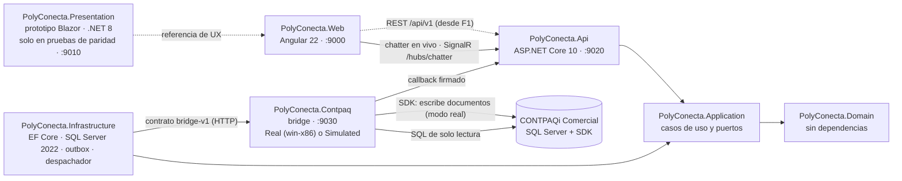

# Arquitectura técnica

Cómo está armada la solución, qué hace hoy cada proyecto y qué deuda técnica hay que resolver antes de construir. Las reglas que gobiernan todo esto están en la [constitución](../../.specify/memory/constitution.md).

## 1. Principios que condicionan la arquitectura

| Principio | Consecuencia técnica |
| :--- | :--- |
| I · CONTPAQi es el sistema de registro | PolyConecta no factura ni guarda saldos contables oficiales; los refleja. No se despliega Odoo: solo se imita su experiencia. |
| II · Sincronización asíncrona con outbox | Toda escritura a CONTPAQi pasa por un outbox y un bridge x86 de un solo hilo con el SDK de Comercial, `MGWServicios.dll` (D-88, constitución 1.6.1). **Prohibido** hacer `INSERT` o `UPDATE` directo en tablas `adm*`. La planta nunca espera un bloqueo del ERP. |
| III · Catálogos | La MP es un catálogo único entre plantas; el PT puede tener código por cliente. |
| IV · Balance de masa y hard-stop | Tolerancia configurable, auditoría obligatoria por corrida y ningún movimiento sin liberación de Calidad. |
| VI · Alcance de Fase 1 | No hay handheld, terminal ni escáner: el Planner captura en la aplicación web. Montemorelos, el intercompany, el peletizado y la báscula IoT quedan para la Fase 2. |
| VII · Respaldo técnico | Toda decisión de SDK o BD se respalda en `docs/contpaq/` o en documentación oficial verificada. |
| VIII · Realidad de CONTPAQi | El modelo se contrasta con las tablas `adm*` reales antes de ratificarse. |
| IX · Odoo 19 como referencia de UX | Kanban, lista y formulario, pipeline de estado, smart buttons y chatter. |

## 2. Solución

`Polyconecta.slnx` · **.NET 10** (SDK 10.0.300 o mayor de la misma versión 10.0, `global.json` con `latestFeature`, D-133), versiones exactas en `Directory.Packages.props` (CT-36). La única excepción es `PolyConecta.Presentation`, que sigue en .NET 8 porque el prototipo no se modifica (D-60).



Desde F1, la web lee y escribe por la API las pantallas de Pedidos, Usuarios, Grupos, Productos, Clientes y Sincronización, con sesión por cookie (§7.2). Las demás siguen siendo la **réplica 1:1 del prototipo** (spec 001), con el estado en memoria del navegador, hasta que su fase las conecte. En desarrollo, el servidor de Angular reenvía `/api` y `/hubs` a la API (`proxy.conf.json`), así la cookie viaja por el mismo origen. El prototipo Blazor se conserva como referencia de comportamiento de las pantallas en memoria (D-60).

## 3. Estado real de cada proyecto

| Proyecto | Qué hace hoy | Destino |
| :--- | :--- | :--- |
| `PolyConecta.Domain` | Base común (04 §1): `AuditableEntity`, `ArchivableEntity`, `DocumentoConEstado` con transiciones nombradas y `SyncState` (CT-15). En `Plataforma/`: `StateTransitionLog`, `ReferenceSequence`, `OutboxMessage`, seguridad (`Plant`, `User`, `Group`, `Permission` y el catálogo de permisos en código), `CatalogSyncState`, `ChatterMessage` y `SavedSearch`. F1 agrega `Inventario/` (`Product` con ficha técnica, clasificación, almacenes de CONTPAQi) y `Ventas/` (`Customer`, `ErpAgent`, `SalesOrder` con sus firmas). Las entidades previas a F0 siguen en `Entities/` sin rediseñar | Modelo de 04 por fase |
| `PolyConecta.Application` | Casos de uso con decoradores propios (registro → autorización → validación → transacción, D-72, R-02). El de autorización exige el permiso de la petición (`IRequierePermiso`) y fija el grupo ejercido; el de transacción transmite el chatter solo al confirmar. Puertos: `IUnitOfWork`, `IClock`, `ICurrentUser` (usuario, nombre visible y grupo ejercido), `IAlmacen<T>` con reglas de fila, `IBridgeLecturas`, `IReferenceSequenceService` e `IBridgeSyncService`. Casos de uso de seguridad, catálogos, sincronización, pedidos, listas, favoritos y chatter | Un caso de uso por acción de negocio |
| `PolyConecta.Infrastructure` | `PolyDbContext` en **SQL Server 2022**, un esquema por módulo (`plt`, `inv`, `ven`, `prd`, `cal`) y migraciones (`F0_*` y, de F1, `F1_Seguridad`, `F1_Catalogos`, `F1_Sincronizacion`, `F1_Pedidos` y `F1_ChatterYFavoritos`). Credenciales con `IdentityUserContext` en `plt.user_credential*` (R-01). Interceptor de auditoría, bitácora y `Cambio` del chatter, filtro de archivado, folios con `UPDLOCK`, consulta de listas (conjunto y modo servidor, D-151) y sembradores (seguridad y, en desarrollo, los usuarios de R1). En `Erp/`: traductores al contrato, cliente HTTP del bridge, verificación de firma y **despachador** (orden, espera por llave, bloqueo por error, reintentos y consulta si no llega el callback) | Persistencia y traductores de cada fase |
| `PolyConecta.Api` | Sesión por cookie (`HttpOnly`, `SameSite=Lax`, 10 h deslizante, bloqueo tras 5 intentos) y toda ruta con sesión salvo entrar y el callback del bridge; las que escriben exigen `X-Requested-With` (R-01). Controladores de F1: sesión, usuarios, grupos, permisos, plantas, sincronización, catálogos, pedidos, listas (`/{modulo}/{lista}/vista`, `/conjunto`, `/consulta`), favoritos y chatter (contracts de la spec 003). Callback del bridge y reintento manual; `X-Correlation-ID` (CT-31); hub del chatter `/hubs/chatter` con sesión. Los controladores previos a F0 siguen | Contrato por caso de uso |
| `PolyConecta.Web` | Angular 22. Rutas por módulo y cargadas de forma perezosa (D-155). Pedidos, usuarios, grupos, productos, clientes y sincronización leen y escriben por la API (§7.2); las demás pantallas siguen siendo la réplica del prototipo (spec 001) con su estado en memoria y el "Nuevo" libre (D-59). Pruebas: Vitest, extremo a extremo de F1 (con la API simulada y contra la API real), guiones de escenario, auditor y chatter con Playwright (ver `PolyConecta.Web/README.md`) | Cada fase conecta sus pantallas a la API |
| `PolyConecta.Presentation` | **Prototipo navegable** en Blazor Server, sin cambios (D-60). Es la referencia contra la que corren las pruebas de paridad de `PolyConecta.Web` | Referencia hasta conectar Angular a la API |
| `PolyConecta.Contpaq` | Bridge con el contrato `bridge-v1`: sobre 1.0, validaciones de CT-39 y D-127, `OutboxWorker` en un hilo STA, callback firmado, lecturas del contrato. **Modo simulado** (`BridgeConfig__Mode=Simulated`, por omisión fuera de Windows) con catálogo semilla, folios por concepto y fallos configurables. En **modo real** los comandos se implementan en su fase (2.4, 3.1, 3.2, 5.1, 6.1) | Comandos reales con ejecución por pasos (CT-38) |
| `tests/` | Dominio, aplicación e integración contra SQL Server con Testcontainers (la API real con `WebApplicationFactory`, clientes con sesión de cada grupo); bridge; **suite de contrato** por HTTP (CT-23) y ciclo completo, que necesitan `BRIDGE_URL` | Una prueba por regla (CT-28) |
| `tools/sdk-lab` | **Retirado** (D-130): registro de cómo se corrió la matriz del SDK. El desarrollo contra el SDK real se hace con el bridge en modo debug en el VPS (`PolyConecta.Contpaq/AGENTS.md`) | Solo consulta |

## 4. Sincronización con CONTPAQi

Cómo viaja una escritura del documento al ERP. Las reglas son CT-13 a CT-21, CT-38 a CT-41 y D-95; el formato de los mensajes está en el [contrato `bridge-v1`](../contratos/bridge-v1.md).

**Outbox (`plt.OutboxMessage`).** El caso de uso inserta el mensaje en el mismo `SaveChanges` que el cambio de negocio: si el negocio falla, no queda mensaje (CT-20). Cada mensaje lleva:
- `Sequence` (`IDENTITY`), que fija el orden de envío (CT-41);
- `IdempotencyKey` `{tipo}:{id}:{transición}`, única (CT-19);
- `LockKeys`: los `producto:<código>` y `almacen:<código>` de la carga, para D-95;
- estado `Pendiente`, `Enviado`, `Confirmado`, `Error` o `Bloqueado`, intentos, `BridgeTransactionId` y último error.

**Despachador (`Infrastructure/Erp/BridgeDispatcher`).**
1. Toma el `Pendiente` de menor secuencia que no comparta llaves con uno `Enviado` o `Error`. Los que comparten pasan a `Bloqueado`: un error detiene solo a los que tocan los mismos productos o almacenes (D-95).
2. Lo envía. Con `202` queda `Enviado`, y no sale otro con llaves en común hasta el callback terminal.
3. Si la red falla o el bridge responde `5xx`, reintenta con espera de 2ⁿ segundos hasta `Erp__MaxIntentos` (5). Al agotarlos, el documento queda en `Error`.
4. Si el callback no llega en `Erp__CallbackTimeoutSegundos` (120), consulta `GET /api/v1/transactions/{id}`.
5. Un bloqueo de aplicación de SQL Server (`sp_getapplock`) garantiza un solo despachador aunque haya varias instancias de la API.

Sistemas reintenta un `Error` con `ReintentarSincronizacion` (D-93): vuelve a `Pendiente` con la misma `IdempotencyKey` y libera a los `Bloqueado` que dependían de él.

**Callback (`POST /api/v1/plataforma/bridge/callbacks`).** Es el `callback_url` de cada comando, con base en `Erp__CallbackBaseUrl`.

| Caso | Respuesta |
| :--- | :--- |
| Sin `X-Bridge-Signature`, firma distinta de `HMAC-SHA256(Erp__CallbackSecret, t + "." + cuerpo crudo)` o `t` a más de 5 minutos | `401` |
| Cuerpo fuera del esquema del callback | `400` |
| `idempotency_key` desconocida | `404`, registrado con su `correlation_id` |
| Mensaje ya `Confirmado`, o estado no terminal (`PENDING`, `PROCESSING`) | `200` sin cambios |
| `CONFIRMED` | `200`: guarda folio, id y `documentos[]` en el `SyncState`, confirma y libera a los `Bloqueado` |
| `FAILED` o `DEAD_LETTER` | `200`: guarda el error y pasa a `Error`; los que comparten llaves siguen bloqueados |

Un `5xx` hace que el bridge reintente la entrega. Los dos últimos casos los hace `ConfirmarSincronizacion` en una transacción.

**Bridge (SQLite).** `bridge_transactions` guarda cada comando con su versión de contrato, variante, resultado y error del contrato; `transaction_logs`, su bitácora; `webhook_deliveries`, cada intento de callback. En modo simulado, `simulated_folio`, `simulated_id` y `simulated_almacen` dan folios por concepto, ids y almacenes. Borrar una transacción borra antes sus filas hijas. En modo real la sesión del SDK se abre solo cuando hay transacciones pendientes y se cierra tras `IdleSessionTimeoutSeconds` sin trabajo.

**Catálogos (lecturas, R-05, D-150).** `SincronizarCatalogo` lee completo cada catálogo del bridge (`IBridgeLecturas`, páginas con cursor) y escribe solo lo que cambió, por id de CONTPAQi; al terminar la lectura archiva lo inactivo y lo ausente, y restaura lo reactivado. Lo que es de PolyConecta no se pisa: la clasificación (solo se llena si está vacía), la ficha técnica y el enlace a ubicaciones (CT-14). Corre cada `Erp:Sincronizacion:IntervaloMinutos` (15) y bajo demanda (`POST /api/v1/plataforma/sincronizacion[/{catalogo}]`), con un `sp_getapplock` por catálogo; el resultado de cada uno queda en `plt.catalog_sync_state`.

**Pruebas.** Las de integración usan SQL Server 2022 con Testcontainers: un contenedor por corrida y una base por clase, creada con las migraciones (CT-06). La suite de contrato (`tests/PolyConecta.Contract.Tests`) no referencia otros proyectos, corre por HTTP contra cualquier bridge y omite las pruebas con el rasgo `Simulado` contra el real (CT-23).

## 5. Deuda técnica conocida

1. **Credencial en el historial.** La contraseña de `sa` estuvo versionada hasta el 28-sep y el historial no se reescribe (D-51). El bridge ya no usa `sa`: lee con el login de solo lectura `polyconecta_bridge_ro`, creado el 6-oct, y toma su cadena de `BridgeConfig__SqlConnectionString`. **`sa` no se rota por ahora**, porque CONTPAQi se conecta con ella (D-129); falta el procedimiento para cambiarla en SQL Server y en CONTPAQi a la vez (H-04).
2. ~~Sin persistencia real~~. Resuelta en F0: SQL Server 2022 con migraciones y logins separados (CT-30).
3. **Parte de la UI no usa el backend.** Desde F1, Pedidos y las pantallas de plataforma y catálogos van por la API. Las de producción, calidad y logística siguen con la lógica del prototipo portada a `src/app/core/state/`; cada fase las reemplaza por su API.
8. **Margen de la carga inicial.** Con la sesión en la barra superior, la carga inicial queda en 90 990 bytes comprimidos contra 91 136 del límite de 89 kB (D-143). Con esbuild, el código de un paquete que también alcanza `main` entra a la carga inicial en cuanto una ruta perezosa lo usa (`@angular/common/http`, `CommonModule`, operadores de rxjs): por eso la web no usa `HttpClient` ni `CommonModule` en las pantallas.
4. **Gateway real del SDK.** El bridge real todavía no implementa los comandos del contrato; la ejecución por pasos con reconciliación (D-80, CT-38), los N lotes por movimiento (D-82), el par Salida + Entrada (D-79), la sesión de larga duración con doble inicio de sesión (D-91, D-108) y la verificación posterior (CT-39) llegan con cada comando.
5. ~~Sin CI~~. Resuelta en F0: GitHub Actions con los trabajos `dotnet`, `contrato` y `web` (CT-27). `main` está protegida desde el 6-oct: exige PR y los tres checks en verde, sin excepciones (CT-44).
6. **Supuestos del SDK**: la [matriz](../contpaq/MATRIZ_PRUEBAS_SDK_WIP_LOTES.md) verificó WIP como almacén, lotes múltiples y fraccionados, devolución parcial y parcialidades (D-79 a D-87). Siguen abiertos la frescura de la lectura (T-06) y el costo de la entrada (T-17).
7. **Bridge como proceso interactivo**: el SDK no funciona como servicio de Windows (S-03, D-108). Corre sin ventana en la sesión del administrador, con inicio de sesión automático y la tarea `PolyConecta-Bridge` (D-115). Medido el 6-oct: escucha 0.8 min después de arrancar Windows. Los scripts están en `scripts/vps/`.

## 6. Cómo correrlo

Requisitos: SDK de .NET 10 (`global.json`), Docker y Node 24.16 (`PolyConecta.Web/.nvmrc`). El runtime de ASP.NET Core 8 solo hace falta para las pruebas de paridad, que levantan el prototipo en `:9010`; `run.sh` ya no lo levanta (D-128).

```bash
./run.sh                 # compila, prueba y levanta PolyConecta.Web (:9000) + API (:9020); comprueba Node 24.16 y corre npm ci si falta
./run.sh --with-bridge   # además levanta el bridge (:9030), en modo simulado fuera de Windows, conectado a la API
./run.sh --solo-web      # solo PolyConecta.Web (:9000): sin .NET, SQL Server, pruebas ni API; el chatter queda sin conexión en vivo
cd PolyConecta.Web && npm ci && npm start   # solo la aplicación Angular (:9000)
```

Sin `ConnectionStrings__PolyConecta`, `run.sh` levanta un SQL Server 2022 local en Docker (`polyconecta-sql`, puerto 14333), crea los logins de `scripts/sql/logins-desarrollo.sql` con contraseñas generadas en `.env.local` y aplica las migraciones con `dotnet ef` (herramienta local en `dotnet-tools.json`).

En `.env.local` también genera la contraseña del Administrador inicial (`LOCAL_ADMIN_PASSWORD`, que exporta como `Seguridad__AdministradorInicial__Contrasena`) y la de los usuarios de ejemplo de R1 (`LOCAL_R1_PASSWORD`, como `Seguridad__DatosR1__Contrasena`). En desarrollo, la API crea al arrancar los usuarios de R1 (`ac1`, `comercial1`, `cobranza1`, `cobranza-suplente`, `doble`, `planner-pim` y `sistemas`); fuera de desarrollo, solo con `Seguridad__SembrarDatosR1=true`. `scripts/dev/sembrar-pedidos.sh N` crea N pedidos por la API en estados variados. El guion de la revisión con la operación está en [`docs/revisiones/R1.md`](../revisiones/R1.md).

La suite de contrato y el ciclo completo corren contra un bridge levantado:

```bash
BRIDGE_URL=http://localhost:9030 BRIDGE_CALLBACK_SECRET=<el de BridgeConfig__CallbackSecret> \
  dotnet test --project tests/PolyConecta.Contract.Tests
```

| Script | Uso |
| :--- | :--- |
| `scripts/build.sh` | Empaqueta el bridge para Windows x86 |
| `scripts/deploy.sh` | **Obsoleto**: publicaba en IIS, que ya no se usa en el VPS |
| `scripts/vps/` | Publicar, arrancar sin ventana, depurar y medir el bridge en el VPS ([README](../../scripts/vps/README.md)) |
| `scripts/dev/sembrar-pedidos.sh` | Crea pedidos de ejemplo por la API como `ac1`, en estados variados (necesita la API y los usuarios de R1) |
| `scripts/screenshots.sh` | Recorre el prototipo con Playwright y guarda capturas en `docs/screenshots/` |
| `scripts/sql/logins-desarrollo.sql` | Base y logins de PolyConecta para desarrollo y CI (CT-30) |

## 7. Interfaz: `PolyConecta.Web`

Viene de la spec 001 (réplica del prototipo en Angular). Es la base de las pantallas de F1 en adelante (D-118).

### 7.1 Sistema de diseño (CT-24)

- **Estilo**: el `app.css` del prototipo con la variante A de botones ("Índigo afinado", D-135), Bootstrap 5.3.2 y la fuente Inter. Los íconos son Lucide, por nombre de intención con `pc-odoo-icon`; Bootstrap Icons ya no se carga. Las clases `o_*` reproducen Odoo 19 (Principio IX).
- **Estructura de todo documento**, en este orden: panel de control (`o_control_panel`: "Nuevo", migas con el engranaje de acciones y smart buttons) → barra de acciones (`o_statusbar`: acción primaria y secundarias; a la derecha, el estado de sincronización si lo lleva) → hoja (`o_form_sheet`: etapas, título y folio, campos en dos columnas, pestañas y líneas) → chatter a la derecha. Las listas usan el mismo panel con la barra de búsqueda al centro y el cambio de vista a la derecha.
- **Contratos visuales**: cada patrón y componente tiene su contrato en [07](07-contratos-visuales.md), su ejemplo en la galería `/catalogo` y sus pruebas. Listas `pc-odoo-list` (TanStack Table en modo servidor sobre un `OrigenDeLista`), kanban `pc-odoo-kanban` (CDK), pestañas, diálogos, campos y menús con CDK y Spartan `brain` (D-135). Una pantalla nueva compone esos contratos (CT-24).
- **Componentes compartidos** (`src/app/shared/`): además de los del punto anterior, `odoo-topbar`, `odoo-breadcrumb`, `odoo-search-panel` (vistas de búsqueda declarativas con facetas; filtros del mismo campo se unen con "o", de campos distintos se cruzan), `odoo-view-switcher`, `odoo-pager`, `odoo-smart-buttons`, `odoo-status-pipeline`, `odoo-line-capture`, `odoo-chatter-drawer`, `lot-picker-modal`, `lot-quantity-picker-modal` y `poc-sales-order-form`. Para el modo libre: `boton-nuevo` y `hoja-nueva`.
- **Acciones de cada documento** (`features/<flujo>/*-acciones.ts`): las transiciones con nombre que usan el botón del formulario y el arrastre del kanban, para que cada una tenga una sola regla (D-138).
- **Captura de líneas**: `[Clave / Producto] [Cantidad] [Unidad] [Agregar]`. Si el producto está en el catálogo de CONTPAQi, la unidad se precarga. En modo libre la unidad es la base del producto y no se edita (D-127), y el pedido libre agrega precio unitario y moneda (D-74).
- **Smart buttons** de un documento libre: vacíos o deshabilitados, nunca con un origen falso (FR-014 de la spec 001).

### 7.2 Pantallas con API y pantallas en memoria

**Con API (F1).** Todas las peticiones van por `core/sesion/api.ts` (`pedirApi`, `respuestaApi`, `ErrorApi`) sobre `fetch`: agrega `X-Requested-With` y `X-Correlation-ID`, manda la cookie y, ante un `401`, deja decidir a `proveerClienteApi()` (registrado en las rutas perezosas): con captura pendiente abre el inicio de sesión en un diálogo sobre la página y repite la petición; sin ella, lleva a `/login?volver=`. La sesión (`SesionState`) solo guarda el estado; cargarla, entrar y salir están en `SesionAcciones`, fuera de la carga inicial. Las rutas con sesión llevan `sesionGuard`. Los documentos se abren por id (D-154).

**Listas HTTP (D-151, FR-029).** `OrigenHttp` pide la vista de búsqueda (`GET …/vista`) y el conjunto: si cabe en el umbral (5,000 filas), filtra, busca, agrupa, ordena y pagina en el navegador sin más peticiones, con los filtros con nombre evaluados por el `_filtros` que calcula el servidor (incluidos los del usuario, como "Mis pedidos"); si no cabe, cada consulta va al servidor. Tras un cambio propio, `invalidar()` vuelve a pedir el conjunto. `pc-odoo-list` con `estadoEnUrl` refleja búsqueda, filtros, agrupación, orden, página y tamaño en la URL, y con `almacenFavoritos` guarda los favoritos por usuario en la base (`FavoritosHttp`).

**En memoria (réplica).**

- Los servicios de `Presentation/Services` están portados a `src/app/core/state/` con signals: mutan los mismos objetos y exponen la señal `cambios`. Un `computed` que devuelve el mismo objeto mutado lleva `{ equal: () => false }`.
- Lo que en el prototipo era un documento único (pedido, traslado, recepción y entrega) es una **colección con su documento semilla**; las operaciones reciben el folio. Así "Nuevo" puede crear otro sin romper la paridad.
- El estado vive en memoria y se pierde al recargar, igual que el circuito de Blazor.

### 7.3 Modo libre ("Nuevo", D-59)

"Nuevo" abre `<lista>/nuevo`: la hoja del documento en su estado inicial, con los campos mínimos, "Guardar" y "Descartar". Al guardar se crea el documento libre y se abre su formulario. Las reglas viven en `src/app/core/state/libre/`, cada una con su prueba:

| Documento | Regla |
| :--- | :--- |
| Pedido | Cliente; líneas con cantidad, unidad, precio y moneda. Al confirmar recibe un Contpaq ID simulado y sigue las dos firmas (D-53, D-74) |
| Orden de fabricación | Sin pedido. Lotes con el folio de la OF raíz, `R001-BOL-2026-0007` (D-54). Al confirmarla genera recolección y control como una ligada |
| Recolección y devolución | Planta y líneas. Sin OF: el saldo queda sin asignar en WIP (D-55) y la devolución regresa ese saldo |
| Asignar saldo de WIP | Acción de la OF, solo cuando hay saldo sin asignar de sus componentes; nada se liga solo (FR-013 de la spec 001) |
| Control de calidad | Sobre lotes existentes en revisión; aprobar o rechazar tiene el mismo efecto que en el control ligado |
| Traslado y entrega | Solo lotes liberados por Calidad: libres en `<planta>/Stock/*`, fuera de cuarentena (hard-stop) |
| Recepción | Solo lotes en `TRANS/*` (D-56). El traslado libre deja sus lotes ahí al llegar a Hecho |

Los folios libres (`PV-2026-0001`, `QC-2026-0001`, la siguiente OF de su proceso) son de la réplica; al conectar la API los dará `IReferenceSequenceService`.

### 7.4 Chatter (D-58, D-78, R-04)

`PolyConecta.Api` expone `ChatterHub` en `/hubs/chatter`; exige sesión, y la web lo usa por el proxy, en el mismo origen.
- **Documentos guardados** (en F1, el pedido, `ventas.pedido`): el panel recibe `documento`, carga el historial (`GET /api/v1/plataforma/chatter/{tipo}/{id}`, páginas de 50), se une al grupo del documento (`UnirseADocumento`) y envía con `EnviarMensaje(tipo, id, clase, texto)`, donde `clase` es `Mensaje` o `Nota` (interna). El caso de uso guarda con el autor y el grupo de la sesión y, al confirmar la transacción, el mensaje llega como `MensajeChatter` a quien tenga el documento abierto; el propio no se duplica (por id). Cada transición escribe su `Cambio` ("Borrador → Confirmado", con la nota de la transición) en el mismo guardado, sin que el caso de uso lo haga; una transacción revertida no deja ni mensaje ni transmisión.
- **Pantallas en memoria**: siguen con `SendMessage(documentId, author, text)` y `ReceiveChatterMessage`, sin guardar, hasta que su fase las conecte; necesitan sesión. Sin conexión, el mensaje se agrega solo en local y el panel avisa "Sin conexión en vivo".

### 7.5 Verificación

`PolyConecta.Web/README.md` describe los scripts. Desde la spec 011 **no se comparan píxeles** con el prototipo (D-135): los guiones de escenario comparan el texto de cada punto de control y el auditor compara URL, texto y navegación, los dos contra el prototipo corriendo. Un paso `soloAngular` es el clic de un diálogo que solo tiene la réplica (D-139). Antes de comparar, el corredor lleva los nombres de producto y los botones inteligentes de las dos aplicaciones a una forma común (D-141); los `esperado` de cada paso se revisan contra el texto real. La galería tiene sus pruebas en `e2e/catalogo/` y `npm run tablero` recaptura las 28 pantallas para el lienzo. Las pruebas de F1 (`npm run e2e`, carpeta `e2e/f1`) prueban las pantallas con la API simulada (`page.route`) y, contra la API real con los usuarios de R1, el recorrido del pedido (`pedido-real.spec.ts`) y el chatter con dos navegadores (`chatter.spec.ts`); estas necesitan `./run.sh --with-bridge` y los catálogos sincronizados. La CI corre build, el límite de la carga inicial (`verificar-build`, 89 kB) y las pruebas unitarias; escenarios, auditoría y galería se corren antes de integrar una fase de interfaz. Las diferencias legítimas con el prototipo son tres, más las de la spec 011 (botones de la variante A, íconos Lucide, kanban en las 8 listas de documentos con transiciones al arrastrar, el "Nuevo" completo de D-136, los diálogos de D-139, el paginador por grupos de una lista agrupada y, en las listas migradas, el botón de columnas, el menú de filas por página y las secciones "Agrupar por" y "Favoritos" del menú de búsqueda): el pedido aplica al instante el bloqueo de líneas al autorizar (el prototipo no se vuelve a pintar), una ruta inexistente muestra "Página no encontrada" (el prototipo devuelve un 404 vacío) y "Nuevo".
