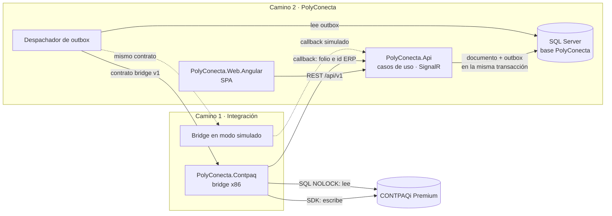

# Constitución técnica

Reglas de construcción de PolyConecta. Desarrolla los principios de la [constitución del proyecto](../../.specify/memory/constitution.md) en decisiones técnicas concretas.

- **Precedencia**: constitución del proyecto → este documento → resto de `docs/diseno/`.
- **Qué contiene**: decisiones **normativas**, identificadas como `CT-NN`. Cambiar una regla requiere una decisión en [decisiones.md](decisiones.md).
- **Qué no contiene**: el estado actual del código ([05-arquitectura-tecnica.md](05-arquitectura-tecnica.md)) ni el orden de trabajo ([ROADMAP.md](../ROADMAP.md)).

---

## 1. Topología

- **CT-01** PolyConecta es un sistema **independiente**: funciona completo con su base y el bridge en modo simulado. CONTPAQi es un destino de integración, no una dependencia de ejecución.
- **CT-02** El **único** punto de contacto entre los dos caminos es el **contrato del bridge** (sección 5). Ningún componente de PolyConecta llama al SDK ni lee tablas `adm*`; ningún componente del bridge lee la base de PolyConecta.
- **CT-03** Pasar de simulado a real, por módulo, es un cambio de configuración (URL y lista de comandos habilitados), no de código.

## 2. Stack

| Pieza | Versión ratificada | Regla |
| :--- | :--- | :--- |
| Runtime y SDK .NET | **.NET 10 LTS** (D-67) | **CT-04** Todos los proyectos .NET usan la misma versión, **incluido el bridge x86** (`win-x86`). El bridge migra después de verificar `sdk-lab` contra `MGWServicios.dll` en el laboratorio (D-88) |
| Web API | ASP.NET Core 10 | — |
| Base de datos | **SQL Server 2022** (D-49, D-70) | **CT-05** Base propia, separada de las de CONTPAQi; en producción, en una instancia o servidor distinto al de CONTPAQi |
| Acceso a datos | EF Core 10 con el proveedor de SQL Server | **CT-06** El esquema solo cambia por migraciones versionadas en el repositorio; nunca a mano |
| Identidad | ASP.NET Core Identity 10 (D-32) | Usuarios propios; roles y reglas de fila según [01-modulos-y-roles.md](01-modulos-y-roles.md) |
| Casos de uso | Servicios de `PolyConecta.Application`, sin MediatR (D-72) | La lógica transversal (transacción, auditoría, validación) va en decoradores propios |
| Frontend | **Angular 22** con TypeScript 6.0 (D-68) | Componentes standalone |
| Build del frontend | **Node 24 LTS** (D-69) | — |
| Estilos | Bootstrap 5.3.2 y Bootstrap Icons 1.11.3 | Iguales al prototipo mientras dure la paridad de la spec 001 |
| Tiempo real | SignalR (`@microsoft/signalr`) | Chatter y avisos de sincronización. Los mensajes del chatter se guardan en la base (D-78) |
| Pruebas .NET | **xUnit v3** + AwesomeAssertions (D-71, D-72) | Una sola versión en todos los proyectos de prueba |
| Pruebas extremo a extremo | Playwright | — |
| Bridge | .NET 10 `win-x86`, SQLite, SDK de CONTPAQi (`MGWServicios.dll`) | Proceso aparte en una sesión interactiva de Windows; único usuario del SDK (Principio II, D-88) |

- **CT-36** **Política de versiones (D-73).** Las versiones se fijan exactas y centralizadas: `global.json` (SDK de .NET), `Directory.Packages.props` (paquetes NuGet), `.nvmrc` (Node) y `package.json` sin `^` ni `~`. Parches y versiones menores se actualizan una vez al mes en un PR propio, con todas las pruebas en verde. Una versión mayor solo cambia por decisión registrada. No se usan paquetes con licencia comercial sin decisión registrada.

## 3. Capas y módulos

- **CT-07** Arquitectura limpia con dependencias en un solo sentido: `Web → Api → Application → Domain`, e `Infrastructure → Application/Domain`. `Domain` no depende de nada.
- **CT-08** Los casos de uso viven en un proyecto **`PolyConecta.Application`**: confirmar, autorizar, validar, cerrar… Los controladores de la API solo traducen HTTP ↔ caso de uso.
- **CT-09** El código se organiza **por módulo dentro de cada capa**, con los mismos nombres en todas: `Plataforma`, `Inventario`, `Ventas`, `Produccion`, `Calidad`, `Logistica`. En Angular, `src/app/features/<modulo>/`.
- **CT-10** Un módulo **no escribe en las tablas de otro**. Lo usa a través de sus casos de uso o reacciona a sus eventos de dominio. Por ejemplo, Producción no inserta movimientos de inventario: pide a Inventario que los registre.
- **CT-11** Las reglas de negocio viven en `Domain` y `Application`. La interfaz solo muestra, captura e invoca; no decide.

## 4. Datos y paridad con CONTPAQi (D-62)

- **CT-12** Cada módulo tiene su **esquema** en SQL Server: `plt`, `inv`, `ven`, `prd`, `cal`, `log`. El modelo es el de [04-modelo-de-dominio.md](04-modelo-de-dominio.md), no una copia de las tablas `adm*`.
- **CT-13** La paridad vive en dos piezas:
  1. **Columnas `erp_*`**, anulables, en cada entidad que tiene contraparte en CONTPAQi (`erp_product_id`, `erp_warehouse_id`, `erp_document_id`, `erp_folio`…). Están vacías mientras el módulo corre con el simulador o el documento no se ha sincronizado.
  2. **Catálogo de mapeo** `plt.erp_mapping`: tipo de entidad, id de PolyConecta, código CONTPAQi, id CONTPAQi y estado. Traduce lo que no es 1:1: conceptos de documento, series, agentes.
- **CT-14** Cada catálogo tiene **un solo dueño**:

| Catálogo | Dueño | Cómo llega al otro lado |
| :--- | :--- | :--- |
| Productos, clientes, conceptos, agentes | CONTPAQi | Lectura por el bridge y sincronización a PolyConecta |
| Ubicaciones y almacenes | PolyConecta (D-43) | Alta en CONTPAQi al inicializar (T-10) |
| Conceptos de Salida y Entrada de PolyConecta | PolyConecta (D-89) | Alta en CONTPAQi al inicializar; mapeo en `plt.erp_mapping` |
| Clasificación de productos | PolyConecta (D-86) | No se replica; la de CONTPAQi sirve de valor inicial |
| Ficha técnica, rutas, centros de trabajo, motivos de scrap | PolyConecta | No se replican |
| Pedidos | Compartido (D-53) | Los de CONTPAQi se sincronizan; los libres se dan de alta por el bridge |
| Recepciones de compra | CONTPAQi (D-96) | Lectura por el bridge y sincronización a PolyConecta como entrada de solo lectura (D-102) |

- **CT-15** Todo documento que escribe en CONTPAQi tiene un **estado de sincronización** propio, visible en su formulario: `No aplica`, `Pendiente`, `Enviado`, `Confirmado` o `Error`. Es independiente de su estado de negocio: un traslado puede estar `Hecho` y su sincronización en `Error`. Los errores los atiende el rol Sistemas desde un tablero de sincronización (D-93).
- **CT-16** La **unidad base es KG** en todo el modelo (D-03). La conversión a la unidad de CONTPAQi ocurre en el contrato, no en el dominio.

## 5. Contrato del bridge (D-63)

- **CT-17** El contrato es la **API HTTP del bridge**, versionada como `v1` y documentada en `docs/contratos/bridge-v1.md` con su OpenAPI. Tiene dos partes:
  - **Escrituras**: `POST /api/v1/transactions`, con `command_type`, `idempotency_key`, `correlation_id`, `callback_url` y la carga del comando.
  - **Lecturas**: catálogos (`/catalogs/*`), existencias (`/inventory/stocks`) y recepciones de compra (`/inventory/purchases`, D-102).
- **CT-18** El contrato define un **catálogo de comandos** con nombre de negocio. Cada comando declara su carga, su resultado y su traducción al SDK:

| Comando | Módulo | Origen en PolyConecta |
| :--- | :--- | :--- |
| `ALTA_ALMACEN` | Inventario | Inicialización de ubicaciones (D-43); por SDK con `fInsertaAlmacen` (D-110) |
| `TRASPASO` | Inventario | Recolección, devolución, traslado, recepción y movimientos de cuarentena. Se traduce a un par Salida + Entrada con N lotes por movimiento (D-79, D-82) |
| `ALTA_PEDIDO` | Ventas | Pedido confirmado en PolyConecta (D-53, D-113); ya remisionado, se cancela en CONTPAQi (D-114) |
| `CIERRE_PRODUCCION` | Producción | Cierre técnico: Salida desde WIP (consumo) + Entrada de PT y scrap con sus lotes (D-111) |
| `REMISION` | Logística | Entrega validada; queda pendiente de facturar en CONTPAQi (S-13) |

- **CT-19** La `idempotency_key` es `{tipo de documento}:{id}:{transición}`. Reenviar un comando nunca duplica un documento en CONTPAQi. El SDK no es idempotente (prueba G-02): la garantía es del bridge.
- **CT-20** El outbox de PolyConecta se escribe **en la misma transacción** que el cambio de negocio. El despachador reintenta con espera creciente. Un comando que agota reintentos deja el documento en sincronización `Error`, recuperable desde la interfaz sin tocar la base.
- **CT-21** El **bridge en modo simulado** implementa el contrato completo sin SDK: valida la carga, asigna folios simulados y responde por callback. Corre en macOS y en CI. Es la base de trabajo del camino 2.
- **CT-22** Un cambio al contrato requiere la aprobación de **los dos líderes**. Los cambios compatibles suben la versión menor; los incompatibles abren `v2` y conviven con `v1` hasta migrar.
- **CT-38** **Ejecución por pasos y reconciliación (D-80).** El bridge registra cada paso de un comando (documento y movimiento) y marca cada documento con una referencia derivada de la `idempotency_key`, de 20 caracteres como máximo porque es lo que mide `CREFERENCIA` (prueba S-06). Antes de reintentar, lee CONTPAQi y completa solo lo que falta. Nunca borra un documento con movimientos: lo completa o lo compensa con el inverso.
- **CT-39** **Validar antes, verificar después (D-81, D-112).** Antes de enviar, el bridge valida existencia por lote en el origen, `Σ lotes = unidades` de cada movimiento y que el producto esté activo. El folio se lee por SQL después de crear el documento. Después, lee `admMovimientos` y `admMovimientosCapas` y compara con la carga. Una diferencia es un `Error`, no un éxito.
- **CT-40** **Sesión del SDK (D-88, D-91, D-108).** El bridge inicia el SDK **una sola vez por proceso**, con dos inicios de sesión y credenciales en variables de entorno (CT-29): usuario de Comercial con `fInicioSesionSDK` antes de `fSetNombrePAQ`, y usuario centralizado con `fInicioSesionSDKCONTPAQi` después. Sin ellos aparece una ventana de ingreso que bloquea la llamada. Abre la empresa por lote de comandos, aplica un timeout a cada llamada y cierra empresa y SDK al apagarse. Se reinicia en una ventana diaria configurable. Corre en la sesión de Windows del administrador, con inicio de sesión automático y una tarea "al iniciar sesión" que lo levanta (D-115): como servicio no funciona (S-03) y en un usuario dedicado falla Contabilidad (S-04).
- **CT-41** **Orden (D-92).** El despachador envía los comandos en el orden de registro del outbox, uno a la vez. Metas de latencia: segundos para movimientos de inventario y minutos para documentos y catálogos. Un comando en `Error` detiene solo los posteriores que comparten alguna llave (producto, almacén) con él (D-95).
- **CT-42** **Existencia oficial (D-94).** Toda validación de existencia usa la de CONTPAQi menos las salidas pendientes de sincronizar. La conciliación corre cada noche fuera del turno de registro (D-98); todas sus diferencias, sin umbral (D-101), las revisa Sistemas antes de ajustar PolyConecta, y nunca se corrige CONTPAQi en automático (D-97).
- **CT-23** El contrato se prueba desde los dos lados con la **misma suite**: el camino 2 la corre contra el simulador en CI, y el camino 1 contra el bridge real en el laboratorio (`tools/sdk-lab`, empresa `_LAB`). Un comando está entregado cuando pasa en los dos.

## 6. Interfaz

- **CT-24** La interfaz sigue los patrones de Odoo 19 (Principio IX) y el sistema de diseño de la spec 001.
- **CT-25** Todo documento tiene sus dos modos: ligado y libre, con "Nuevo" (Principio X).
- **CT-26** Las acciones que un rol no puede ejecutar se muestran deshabilitadas, con la razón visible.

## 7. Pruebas

| Nivel | Qué prueba | Dónde corre |
| :--- | :--- | :--- |
| Dominio | Cada regla de `docs/diseno/`, referenciada por su id (`[008-FR-012]`, `D-54`…) | CI |
| Aplicación | Casos de uso contra SQL Server real (contenedor) | CI |
| Contrato | Suite de CT-23 | CI (simulador) y laboratorio (real) |
| Extremo a extremo | Flujo del módulo en la interfaz, con Playwright | CI |

- **CT-27** Cada PR corre build y todas las pruebas de CI en **GitHub Actions** (D-76), incluida SQL Server 2022 en contenedor. No se integra a `main` con pruebas en rojo.
- **CT-28** Una regla de negocio sin prueba no está construida.

## 8. Seguridad y operación

- **CT-37** **Ambientes (D-77)**:

| Ambiente | Bridge | Para qué |
| :--- | :--- | :--- |
| Local | Simulado | Desarrollo de los dos caminos |
| CI | Simulado | Build y pruebas en cada PR |
| Laboratorio | Real, empresa `_LAB` | Camino 1 y cierre integrado de cada módulo |
| Producción | Real | Operación; su hosting y respaldos están pendientes (H-01, H-02) |

- **CT-29** Ningún secreto se versiona. La configuración sensible va por variables de entorno o `user-secrets` (D-51).
- **CT-30** Mínimo privilegio: el bridge lee CONTPAQi con un login de solo lectura; la API usa en SQL Server un login sin permisos de DDL, y las migraciones se aplican con otro.
- **CT-31** Un `correlation_id` viaja de la interfaz a la API, al outbox, al bridge y al SDK, y aparece en todos los logs.
- **CT-32** Toda transición de estado queda en `StateTransitionLog` con usuario, rol, fecha y documento.

## 9. Cierre de un módulo (D-65)

Un módulo tiene **dos cierres**, y el avance del proyecto se mide con los dos:

**Cerrado en PolyConecta** (camino 2) cuando:
1. Su spec está implementada y todas sus reglas tienen prueba (CT-28).
2. Sus pantallas funcionan en Angular sobre la API, con los dos modos de documento y permisos por rol.
3. Sus comandos pasan la suite de contrato contra el simulador.
4. Su flujo extremo a extremo pasa en CI.
5. `docs/diseno/` refleja lo construido y su spec se borró (regla de `AGENTS.md`).

**Cerrado integrado** (caminos 1 y 2) cuando, además:
1. Cada comando del módulo pasa la suite de contrato contra el bridge real en laboratorio.
2. El flujo extremo a extremo del módulo corre contra el bridge real y lo verifica en CONTPAQi de laboratorio una persona: documento, existencias y lotes.
3. La configuración de producción del módulo apunta al bridge real (CT-03).

## 10. Gobierno de la construcción (D-66)

- **CT-33** Hay **dos líderes**, uno por camino. Cada uno dirige a sus agentes y es dueño de sus carpetas:

| | Camino 1 · Integración CONTPAQi | Camino 2 · PolyConecta |
| :--- | :--- | :--- |
| Entrega | Que cada comando del contrato funcione contra CONTPAQi | Que cada módulo funcione completo con sus tablas y el simulador |
| Carpetas | `PolyConecta.Contpaq/`, `tools/sdk-lab/`, `tests/Contpaq.Bridge.Tests/`, `docs/contpaq/` | `PolyConecta.Domain/`, `Application/`, `Infrastructure/`, `Api/`, `Web.Angular/`, `tests/PolyConecta.*` |
| Compartido | `docs/contratos/`, la suite de contrato y el modo simulado del bridge (CT-22) | |

- **CT-34** Cada módulo es una feature de Spec Kit (`.specify/features/NNN-<modulo>/`) con sus tareas separadas por camino. Los agentes siguen [AGENTS.md](../../AGENTS.md) y las reglas de autonomía de la spec 001.
- **CT-35** El estado de cada módulo se actualiza en el tablero de [ROADMAP.md](../ROADMAP.md) al cumplir cada cierre, con la fecha y el commit que lo demuestra.
