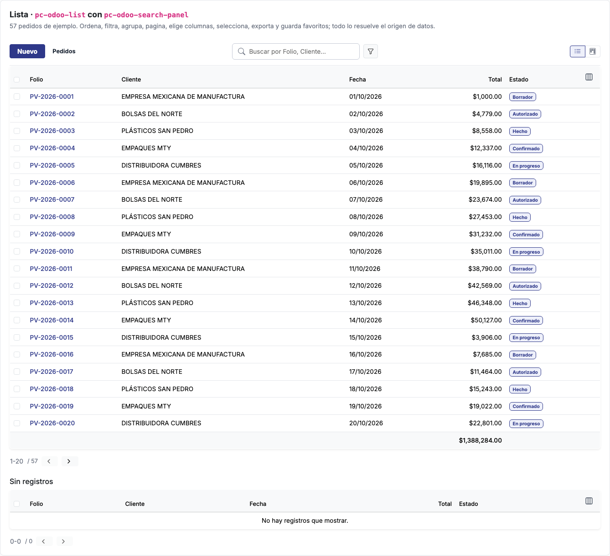
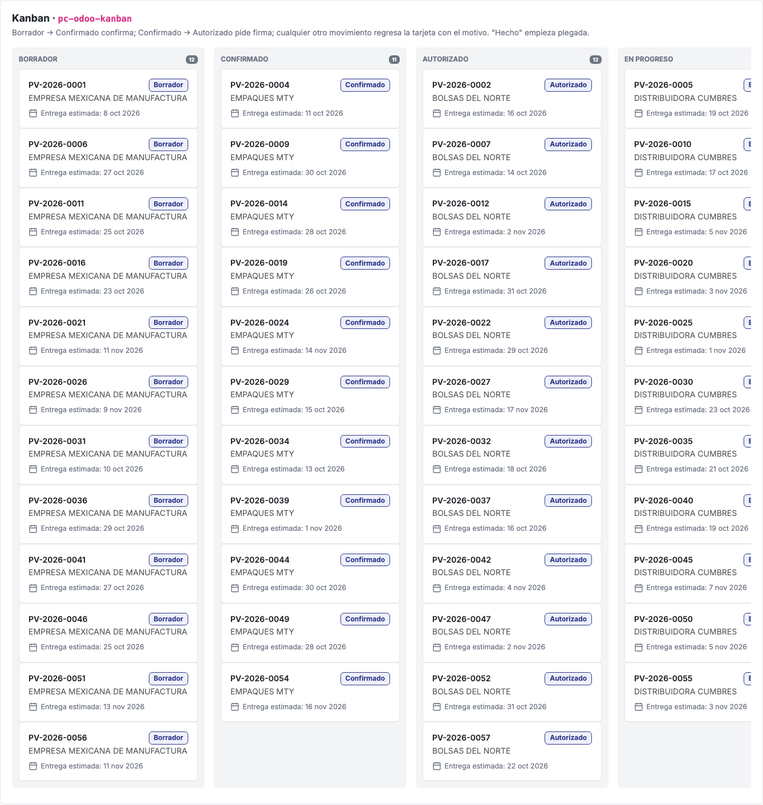
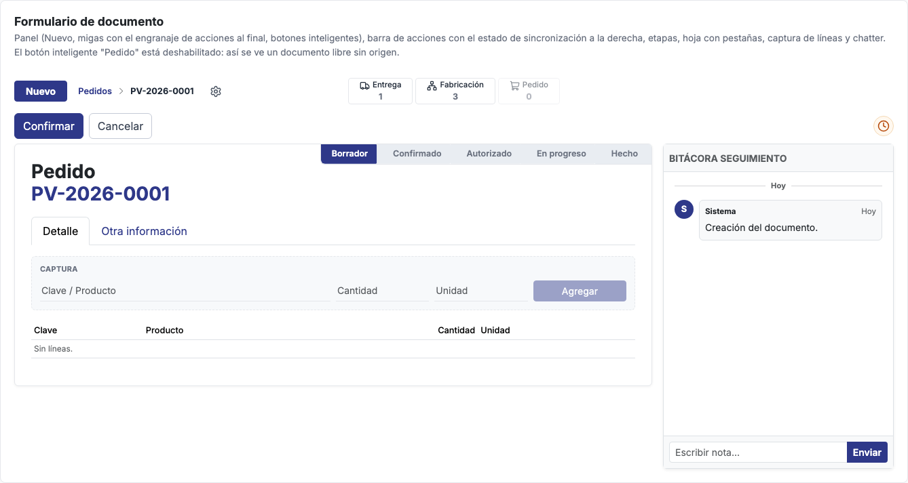
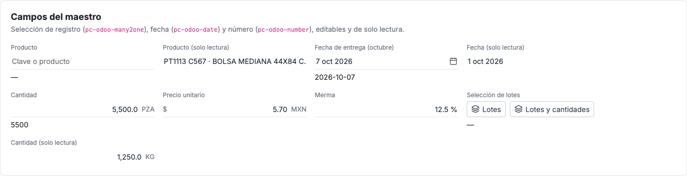
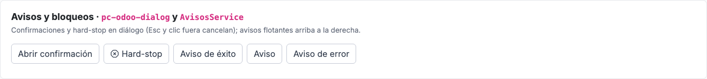
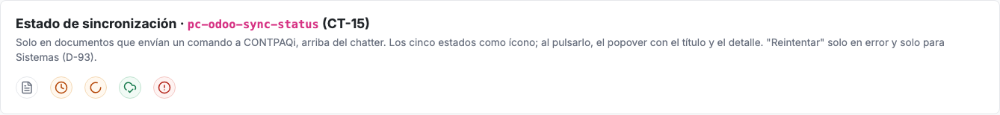
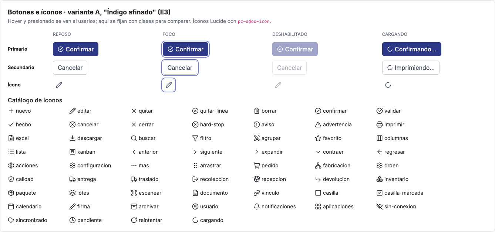
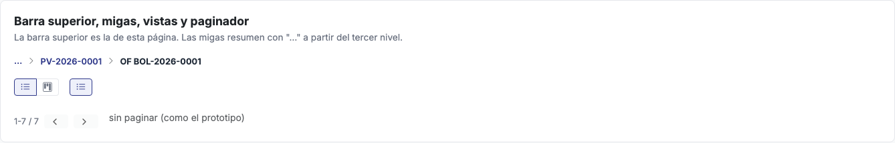
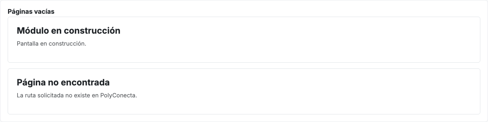

# Contratos visuales

Qué es cada pieza de la interfaz de `PolyConecta.Web`: sus partes, qué recibe, qué emite, sus estados y lo que nunca hace. Una pantalla nueva se diseña **componiendo estos contratos**, no inventando (D-134, CT-24). Cada contrato tiene su ejemplo vivo en la galería `/catalogo` y sus pruebas en `e2e/catalogo/` y junto a cada componente (`*.spec.ts`). Las capturas salen de la galería.

Sistema de diseño (estilo, estructura del documento y modo libre): [05 §7](05-arquitectura-tecnica.md#7-interfaz-polyconectaweb). Librerías: TanStack Table, Angular CDK y Spartan `brain`, todas sin estilo propio; el aspecto lo dan las clases `o_*` de `src/styles/app.css` (D-135).

---

## 1. Patrones de pantalla

### 1.1 Lista

**Anatomía**:
- panel de control: "Nuevo" y migas a la izquierda; al centro, la barra de búsqueda con facetas y el menú de filtros, agrupaciones y favoritos; el cambio de vista (lista y kanban), en la **extrema derecha**, lejos de la búsqueda;
- barra de selección, solo con filas marcadas;
- tabla con casillas, encabezados ordenables y el botón de columnas al final;
- filas de grupo, filas y pie con totales;
- paginador.

**Comportamientos**:

| Hace | Criterio |
| :--- | :--- |
| Ordenar | Clic en el encabezado: primero ascendente, luego descendente. Ordena **todo el filtro** en el origen, no la página |
| Filtrar y buscar | Texto libre sobre los campos de la vista de búsqueda; filtros con nombre del mismo campo con O y de campos distintos con Y. Cambiar el filtro regresa a la página 1 |
| Agrupar | Uno o varios niveles, desde el menú de búsqueda. Cada grupo muestra conteo y subtotales; se abre bajo pedido |
| Columnas | Mostrar u ocultar y subir o bajar entre las visibles. El menú se abre en un popover sobre la página, nunca dentro de la tabla |
| Paginar | 20, 40, 80 (por omisión) o 200 por página; el texto es "inicio-fin / total" |
| Seleccionar | Casillas, con "seleccionar todo" de la página. Aparece la barra con las acciones masivas y "Exportar" |
| Exportar | `.xlsx` con las seleccionadas o, sin selección, todo el filtro; columnas visibles en su orden, números como números y fechas `dd/mm/yyyy` |
| Favoritos | Guardar la búsqueda, la agrupación, el orden, las columnas y el tamaño de página con nombre; uno por omisión se aplica al abrir. Hasta F1 se guardan en el navegador |

**Reglas**:
- **Nunca** ordena, filtra, agrupa ni pagina en el navegador: todo lo pide al `OrigenDeLista` (§4.1).
- Hasta F1 el origen es en memoria; en F1, HTTP, sin cambiar la pantalla.
- Clic en la fila abre el formulario; la casilla no.
- **Jerarquía:** una lista no sangra filas ni dibuja flechas para mostrar dependencias; la relación se consulta con una agrupación (en Fabricación, "Orden maestra", D-142).
- **Aspecto:** la barra de búsqueda es blanca, con borde gris y radio de 6 px, como los botones (no es una píldora); al enfocarla, el borde toma el color primario. En la tabla, los encabezados van en peso medio (500) y el contenido en peso normal, a 0.85rem; ni el folio ni los totales van en negrita.
- **Sin registros:** muestra "No hay registros que mostrar."

**Implementación**: `pc-odoo-list` (TanStack Table en modo servidor) con `pc-odoo-search-panel` y `pc-odoo-pager`.

### 1.2 Kanban

**Anatomía**: una columna por etapa, con título, cuenta y tarjetas. **Cada etapa mide 338 px de ancho, fijo**, tenga las tarjetas que tenga; si no caben, el tablero se desplaza a lo ancho. Las etapas terminales empiezan plegadas (48 px); doble clic en el título pliega o despliega.

**Tarjeta**: en la primera fila, el folio a la izquierda y el **estado arriba a la derecha**, separado del borde por el mismo margen interior de la tarjeta (16 px). Debajo, el dato principal (cliente, proceso) y los datos de apoyo en gris con su ícono, entre ellos la **fecha estimada de entrega** ("Entrega estimada: 30 oct 2026" en el pedido; "Fecha esperada" en la orden de fabricación).

**Comportamientos**:

| Hace | Criterio |
| :--- | :--- |
| Mover con transición | Soltar una tarjeta en otra etapa ejecuta la transición con nombre, el mismo método que el botón del formulario |
| Rechazar | Sin transición declarada, o si no procede, la tarjeta regresa y la columna muestra el motivo |
| Pedir datos | Si la transición pide datos (firma, resultado de calidad), abre su diálogo; la tarjeta se mueve solo si se confirma. El diálogo puede ser condicional: validar una recolección solo lo abre si es parcial |
| Filtrar | Usa la misma búsqueda y los mismos filtros que la lista |

**Reglas**:
- No hay transiciones que solo existan en el kanban.
- Las que avanza el sistema, como Autorizado → En progreso, no se arrastran.
- **Sin estado:** un documento sin estado (incidencias) agrupa por otro campo y no se arrastra.
- **Estado derivado:** si el estado sale del detalle (el control de calidad, de sus lotes), el kanban agrupa por él pero no se arrastra; las acciones van en el formulario.

**Implementación**: `pc-odoo-kanban` (CDK `DragDrop` y `Dialog`).

### 1.3 Formulario de documento

**Anatomía, en este orden**:
1. panel de control: "Nuevo", migas y, donde terminan las migas, el **engranaje de acciones** (solo el ícono, como Odoo); en el centro, los botones inteligentes;
2. barra de acciones: primario y secundarios (Confirmar, Cancelar…) a la izquierda y, en el extremo derecho de la misma línea, el estado de sincronización con CONTPAQi (solo si el documento lo tiene, §1.8). **Sin línea** que la separe del panel: el panel de un formulario no lleva borde inferior;
3. hoja: etapas arriba a la derecha, título y folio, maestro en dos columnas, pestañas y detalle con su captura;
4. a la derecha de la hoja, el chatter, alineado arriba con ella.

**Reglas**:
- **Botones inteligentes** (D-141): un nombre por tipo de documento, en singular con 1 y en plural con otro conteo (Recolección, Traslado, Recepción, Entrega, Pedido, Orden de fabricación, Control de calidad), en este orden: movimientos de inventario, documento origen o relacionado, documentos de control. Se arman con `botonInteligente(tipo, conteo, ruta)`.
- Los botones inteligentes sin origen se ven atenuados y no navegan (documento libre).
- La acción primaria es una sola.
- Las secundarias poco frecuentes (duplicar, imprimir, archivar…) van en el menú del engranaje. No hay botón "Acciones" con texto en la barra.
- El control de calidad conserva la estructura del prototipo: su estado (Planeado, Parcial, Aprobado) es una insignia en la barra de acciones, no etapas en la hoja, porque sale de sus lotes.

### 1.4 "Nuevo" (modo libre)

- El mismo formulario completo, en Borrador y sin origen (D-136): etapas, maestro, pestañas, detalle con captura y chatter.
- Maestro y líneas se guardan con un solo "Guardar".
- El chatter se ve desde el inicio y se activa al guardar.
- Las reglas del documento son las mismas con o sin origen (Principio X).

### 1.5 Pestañas, detalle y captura

- **Pestañas:** marcado `nav-tabs`; con teclado, flechas para moverse entre ellas.
- **Captura de líneas:** `[Clave / Producto] [Cantidad] [Unidad] [Agregar]`.
  - La unidad es la base del producto en CONTPAQi y no se edita (D-127).
  - Al autorizar, las líneas se bloquean.
  - Cada línea tiene sus acciones con botones de ícono (editar y quitar).
- **Implementación:** `pc-odoo-tabs` (Spartan `BrnTabs`) y `pc-odoo-line-capture`.

### 1.6 Campos del maestro

| Campo | Componente | Reglas |
| :--- | :--- | :--- |
| Selección de registro (cliente, producto, almacén) | `pc-odoo-many2one` | Busca en el origen al escribir; hasta 8 opciones, "Sin resultados" y "Buscar más…", que abre la lista completa. Teclado: flechas y Enter. El foco no sale del campo |
| Fecha | `pc-odoo-date` | Calendario en español, semana desde el lunes, `min` y `max`. Muestra "7 oct 2026" |
| Número, moneda, porcentaje | `pc-odoo-number` | Muestra `5,500.0`; al enfocar, `5500`; al salir valida el mínimo y avisa. La cantidad lleva su unidad base, no editable |
| Líneas de otro documento | Botón de enlace (`btn o_btn_link`) que abre `lot-picker-modal` o `lot-quantity-picker-modal` | Sin borde ni fondo, en color primario: "Seleccionar líneas" y "Seleccionar con cantidades" |

**Aspecto de todo campo capturable**: solo una **línea inferior** y fondo **transparente**, sin caja, antes y después de enfocarlo; al enfocarlo, la línea toma el color primario; con error, la línea es roja y el motivo va debajo. Lo extra del campo (signo de moneda, código de moneda, unidad, ícono del calendario) va en gris, sobre la misma línea. Es la clase `o_field` de `app.css` (y `o_inline_input` para un `input` suelto).

En solo lectura el campo es texto sin línea. Todos funcionan con formularios de Angular (`ngModel` o formularios reactivos).

### 1.6 bis Nombre de producto (D-141)

Todo producto se muestra como **"Clave - Nombre"**: en campos, tablas, tarjetas, diálogos y agrupaciones. La clave sigue siendo el identificador (datos, búsquedas y selección). En las tablas de líneas, Clave y Producto son una sola columna "Producto". Se arma con `nombreProducto` (`core/format/producto.ts`) o, si hay que buscar en el catálogo, con `etiquetaProducto` (`core/format/producto-etiqueta.ts`); si el dato trae su propia descripción, se respeta.

### 1.7 Avisos y bloqueos

| Caso | Pieza | Regla |
| :--- | :--- | :--- |
| Confirmación | `pc-odoo-dialog` (o `OdooConfirmacion`) | Título, mensaje, primario y "Cancelar". Esc y clic fuera cancelan; el foco queda dentro |
| Hard-stop (Calidad, existencia) | `OdooHardStop` (sobre `pc-odoo-dialog`) | Explica por qué no procede y qué hacer; un solo botón, "Entendido": no ofrece continuar |
| Acción irreversible (fallar un lote) | `OdooConfirmacion` | Dice la consecuencia y nombra el botón con la acción ("Fallar lote"), no "Aceptar" |
| Resultado de una acción | `AvisosService` | Éxito y aviso se cierran solos a los 4 s; el error se queda hasta cerrarlo |
| Error en la hoja | Alerta en la hoja | Junto al campo o arriba de la hoja, en rojo |

### 1.8 Estado de sincronización con CONTPAQi (CT-15)

- **Quién lo lleva:** solo los documentos que envían un comando del contrato `bridge-v1` (CT-13): pedido (`ALTA_PEDIDO`), orden de fabricación al cerrar (`CIERRE_PRODUCCION`), recolección, devolución, traslado y recepción (`TRASPASO`) y entrega (`REMISION`). Control de calidad e incidencias **no** lo llevan.
- **Dónde va:** en la barra de acciones del formulario, en su extremo derecho, en la misma línea que Confirmar y Cancelar. No empuja el chatter hacia abajo.
- **Cómo se ve:** un **ícono** redondo, con el color y el ícono del estado, sin texto. Al pulsarlo abre un popover con el título del estado, su explicación y el detalle: folio e id de CONTPAQi al confirmar, código y mensaje del contrato en error.
- **Estados:** `No aplica`, `Pendiente`, `Enviado`, `Confirmado` y `Error`.
- **Reintentar:** dentro del popover, solo en `Error` y solo para Sistemas (D-93).
- **Uso:** F1 lo conecta; en la réplica ningún documento sincroniza.
- **Implementación:** `pc-odoo-sync-status`.

---

## 2. Piezas

### 2.1 Botones e íconos (variante A, "Índigo afinado")

| Botón | Clases | Uso |
| :--- | :--- | :--- |
| Primario | `btn btn-primary` | Una acción principal por barra. Solo texto: "Nuevo", "Confirmar" y "Agregar" no llevan ícono |
| Secundario | `btn btn-outline-secondary` | Cancelar, descartar y acciones secundarias |
| Ícono | `btn o_btn_icon` + `aria-label` | Acciones de línea y de tabla |
| Cargando | `o_btn_loading` + ícono `cargando` | Mientras la acción corre |
| Enlace | `btn o_btn_link` | Acción dentro de la hoja que abre un selector; sin borde ni fondo |
| Engranaje de acciones | `pc-odoo-action-menu` (`btn o_btn_icon`) | Junto a las migas del formulario; solo ícono |

- **Estados:** reposo, hover, foco con teclado (anillo de 2 px separado por 2 px de blanco), presionado, deshabilitado (45 %) y cargando. Los colores son las variables de E3 en `app.css`; los componentes no escriben colores sueltos.
- **Íconos:** `pc-odoo-icon` con un nombre del catálogo (`confirmar`, `editar`, `hard-stop`…).
  - Tamaño por contexto: 16 px en botones, 18 px en botones de ícono y 15 px en botones inteligentes.
  - Lucide con trazo 2; solo nombres del catálogo (Bootstrap Icons ya no se carga).

### 2.2 Barra superior, migas, vistas y paginador

| Pieza | Componente | Reglas |
| :--- | :--- | :--- |
| Barra superior | `pc-odoo-topbar` en `pc-main-layout`, con `pc-odoo-systray` a la derecha | Izquierda: el hub, el nombre del módulo o "PolyConecta" si no hay módulo, y el menú del módulo. Derecha: mensajes, el nombre del usuario y su avatar. **Solo el avatar es interactivo; el nombre es texto.** El avatar es un cuadro de 28 px con la inicial; hover y abierto lo marcan con un anillo, sin cambiar su tamaño, y abre Preferencias y Cerrar sesión, alineado a la derecha. Clic fuera o Esc cierran el menú. Hasta F1 no hay inicio de sesión: las dos opciones se ven deshabilitadas |
| Migas | `pc-odoo-breadcrumb` | Nivel actual y uno atrás; lo anterior se resume en "…" |
| Cambio de vista | `pc-odoo-view-switcher` | Lista y kanban; sin kanban, solo lista |
| Paginador | `pc-odoo-pager` | Con `inicio` y `fin` pagina y cambia el tamaño; sin ellos, "1-N / N" como el prototipo |

### 2.3 Selección de lotes

- **`lot-picker-modal`:** elige lotes completos.
- **`lot-quantity-picker-modal`:** elige lote y cantidad; "Tomar" propone lo que falta o lo que tiene el lote, lo que sea menor.
- Van en el marco de `pc-odoo-dialog`: atrapan el foco y cierran con Esc, con clic fuera o con "Cerrar". El folio del lote y la cantidad son campos de línea (`o_field`); cada lote capturado se quita con un botón de ícono.
- Solo ofrecen lotes que pueden moverse: liberados por Calidad (hard-stop). Si se captura un lote que existe pero Calidad no ha liberado, lo dicen con el motivo ("Hard-stop de Calidad: el lote … está en revisión"), no como "no encontrado".

### 2.4 Páginas vacías

- **`pagina-pendiente`:** módulo en construcción.
- **`pagina-no-encontrada`:** ruta inexistente.

---

## 3. Dónde se usa cada patrón

| Patrón | Pantallas (tablero de flujo) |
| :--- | :--- |
| Lista y kanban | Pedidos, Fabricación, Incidencias, Recolecciones, Calidad, Traslados, Recepción y Entregas |
| Formulario | Pedido, OF (bolseo, impresión y extrusión), Recolección, Control de calidad, Traslado, Recepción y Entrega |
| "Nuevo" | Las mismas siete |
| Lista sin kanban | Inventario actual, Inventario para Ventas |
| Captura | Captura masiva |

Las 28 pantallas se migraron a estos componentes en la spec 011 (partes P1 a P8). Transiciones del kanban por lista: D-138; confirmaciones y hard-stop: D-139.

---

## 4. Contratos de datos de la interfaz

Viven en `src/app/core/lista/` y `core/kanban/`. La tabla y el kanban **nunca** ordenan, filtran, agrupan ni paginan por su cuenta: todo lo piden al origen (una prueba cuenta las consultas).

### 4.1 Origen de datos de lista

`OrigenDeLista<T>` tiene un solo método, `consultar(ConsultaLista): Promise<ResultadoLista<T>>`.

| `ConsultaLista` | Regla |
| :--- | :--- |
| `pagina`, `tamano` | Página desde 0; 20, 40, 80 (por omisión) o 200 filas. Agrupada, la página es de grupos de primer nivel |
| `orden` | `{ campo, desc }[]` en orden de prioridad; vacío, el orden de la lista |
| `filtros` | `FiltroLista` (`campo`, operador `contiene`, `igual`, `entre` o `en`, `valor`), con Y entre campos y O dentro del mismo |
| `nombrados` | Filtros con nombre de la vista de búsqueda (`core/search`), evaluados por nombre |
| `busqueda` | Texto libre sobre los campos buscables |
| `agruparPor`, `grupo` | Niveles de agrupación (campo o etiqueta de la vista) y la ruta del grupo que se abre |
| `ids` | Solo esas filas, para exportar las seleccionadas |

`ResultadoLista<T>` trae `filas` (vacío si la respuesta es de grupos), `grupos` (`GrupoLista`: `campo`, `valor`, `etiqueta`, `cantidad`, `totales` y `textos`, como la unidad común), `total` (filas o grupos, para el paginador) y `totales` (sumas de las columnas sumables sobre todo el filtro).

- **`OrigenEnMemoria<T>`** (hasta F1): sobre la colección de un servicio de estado, con su vista de búsqueda, columnas sumables y, si se declara `unidad`, totales solo cuando el grupo comparte unidad (D-140).
- **`OrigenHttp<T>`** (F1): manda la misma consulta a la API; la ruta y el formato quedan en P-28.

### 4.2 Favoritos

`Favorito` (la forma de `SavedSearch`, 04 §3): `lista` (llave, como `ventas.pedidos`), `nombre` único por lista, filtros, búsqueda, agrupación, orden, columnas visibles en su orden, tamaño de página y `porOmision` (uno por lista). `AlmacenDeFavoritos` lista, guarda y borra. Hasta F1, `FavoritosEnNavegador` (`localStorage`, `polyconecta.favoritos.<lista>`); en F1, por usuario en la base.

### 4.3 Kanban

- **`EtapaKanban`**: `valor` (estado o valor del campo de agrupación), `titulo` y `plegada` (las terminales empiezan plegadas).
- **`TransicionKanban`**: `desde`, `hacia`, `nombre` (el del botón del formulario), `dialogo` opcional con su condición `pideDialogo(fila)`, y `ejecutar(fila, datos?)`, que llama a la misma acción que el botón y devuelve el motivo si no procede. Sin transición declarada, la tarjeta regresa con "No se puede pasar de X a Y".

| Lista | Etapas | Se arrastra |
| :--- | :--- | :--- |
| Pedidos | Borrador, Confirmado, Autorizado, En progreso, Hecho | Borrador → Confirmado; Confirmado → Autorizado, con el diálogo de firma |
| Fabricación | Borrador, Planeado, En progreso, Hecho | Borrador → Planeado (pide componentes); En progreso → Hecho (hard-stop de Calidad y WIP en cero) |
| Incidencias | Por centro de trabajo | Nada: no tienen estado |
| Recolecciones | Borrador, En espera, Listo, Hecho | Listo → Hecho, con el diálogo de cantidades si es parcial |
| Calidad | Planeado, Parcial, Aprobado (controles) | Nada: el estado sale de los lotes |
| Traslados | Borrador, En espera de operación, En espera, Listo, Hecho | Listo → Hecho; sin lotes, regresa con el motivo |
| Recepción | Borrador, En espera, Listo, Hecho | Listo → Hecho, con "Validar recepción" (D-56) |
| Entregas | Borrador, En espera, Listo, Hecho | Listo → Hecho; un lote no liberado lo bloquea (hard-stop) |

Lo que avanza el sistema (Planeado → En progreso, Autorizado → En progreso, En espera → Listo al declarar lotes) no se arrastra (D-138).
